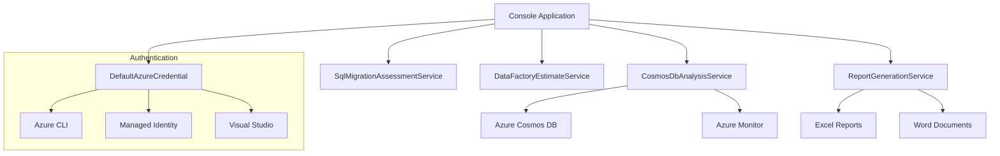

# Cosmos DB to SQL Migration Assessment Tool

[](https://github.com/yourusername/cosmos-to-sql-consoleapp/actions)
[](https://github.com/yourusername/cosmos-to-sql-consoleapp/actions)
[](https://opensource.org/licenses/MIT)
[](https://dotnet.microsoft.com/)

A powerful C# console application for analyzing Azure Cosmos DB databases and generating comprehensive migration assessments for Azure SQL platforms. This tool provides detailed analysis, performance metrics, and actionable recommendations to help you plan and execute successful database migrations.

## ✨ Features

- 🔍 **Deep Cosmos DB Analysis** - Comprehensive database and container structure analysis
- 📊 **Performance Metrics** - 6-month historical performance data from Azure Monitor
- 🎯 **SQL Migration Assessment** - Detailed recommendations for Azure SQL Database, SQL Managed Instance, and SQL Server
- 🚀 **Migration Estimates** - Azure Data Factory migration time and cost calculations
- 📋 **Professional Reports** - Excel and Word documents with executive summaries and technical details
- 🔐 **Secure Authentication** - Azure credential-based authentication with multiple auth methods
- 🌐 **Multi-Database Support** - Analyze single databases or entire Cosmos DB accounts
- 📁 **Organized Output** - Timestamped folders with clear, professional naming conventions

## 🚀 Quick Start

### Option 1: Download Release (Recommended)
1. Download the latest release from [GitHub Releases](https://github.com/yourusername/cosmos-to-sql-consoleapp/releases)
2. Extract the ZIP file for your platform (Windows, Linux, or macOS)
3. Run the executable:

```bash
# Windows
.\CosmosToSqlMigrationTool.exe --endpoint "https://your-cosmos-account.documents.azure.com:443/" --database "your-database" --output "./reports"

# Linux/macOS
./CosmosToSqlMigrationTool --endpoint "https://your-cosmos-account.documents.azure.com:443/" --database "your-database" --output "./reports"
```

### Option 2: Build from Source
```bash
git clone https://github.com/yourusername/cosmos-to-sql-consoleapp.git
cd cosmos-to-sql-consoleapp
dotnet build --configuration Release
dotnet run -- --endpoint "https://your-cosmos-account.documents.azure.com:443/" --database "your-database" --output "./reports"
```

## 📋 Usage Examples

### Analyze a Single Database
```bash
dotnet run -- --endpoint "https://contoso-cosmos.documents.azure.com:443/" --database "ProductCatalog" --output "./reports"
```

### Analyze All Databases in a Cosmos DB Account
```bash
dotnet run -- --endpoint "https://contoso-cosmos.documents.azure.com:443/" --all-databases --output "./reports"
```

### Use with Azure Monitor Integration
```bash
dotnet run -- --endpoint "https://contoso-cosmos.documents.azure.com:443/" --database "ProductCatalog" --workspace-id "12345678-1234-1234-1234-123456789012" --subscription-id "87654321-4321-4321-4321-210987654321" --resource-group "rg-cosmos-prod" --cosmos-account "contoso-cosmos" --output "./reports"
```

### Display Help
```bash
dotnet run -- --help
```

## 📊 What You Get

The tool generates comprehensive reports in timestamped folders:

```
CosmosDB-Analysis_2024-01-15__14-30-45/
├── Executive-Summary.docx           # High-level migration overview
├── ProductCatalog-Analysis.xlsx     # Detailed Excel analysis
├── InventoryDB-Analysis.xlsx        # Additional database (if multiple)
└── Migration-Assessment.xlsx        # Cross-database summary
```

### Excel Reports Include:
- **Database Overview** - Structure, containers, and key metrics
- **Performance Analysis** - RU consumption, latency patterns, and throughput trends
- **Schema Analysis** - Document schemas and field usage patterns
- **SQL Recommendations** - Platform suggestions, service tiers, and pricing
- **Migration Mapping** - Container-to-table and field-to-column mappings
- **Index Recommendations** - Optimized indexing strategies for SQL
- **Cost Analysis** - Migration costs and ongoing SQL platform expenses

### Word Documents Include:
- **Executive Summary** - Business case and recommendation overview
- **Migration Strategy** - Phased approach and timeline recommendations
- **Risk Assessment** - Potential challenges and mitigation strategies
- **Next Steps** - Actionable recommendations for migration planning

## 🏗️ Architecture



## 🔧 Prerequisites

### Required
- **.NET 8.0** or later
- **Azure subscription** with access to:
  - Azure Cosmos DB account
  - Azure Active Directory (for authentication)

### Recommended for Enhanced Analysis
- **Azure Monitor/Log Analytics workspace** (for detailed 6-month performance metrics)
- **Azure CLI** installed and authenticated

### Azure Permissions
The tool requires specific Azure permissions to access resources. See the [Azure Permissions Guide](docs/azure-permissions.md) for complete setup instructions.

**Quick Reference**:
- **Cosmos DB**: `Cosmos DB Account Reader` role
- **Azure Monitor**: `Log Analytics Reader` role (for historical performance metrics)

### Authentication Options
The tool supports multiple authentication methods through Azure DefaultAzureCredential:
1. **Azure CLI** - `az login` (recommended for development)
2. **Managed Identity** - For deployment in Azure
3. **Visual Studio** - Integrated authentication
4. **Environment Variables** - Service principal credentials
5. **Interactive Browser** - Fallback authentication

## 📚 Documentation

- 📖 [Getting Started Guide](docs/getting-started.md)
- 🔐 [Azure Permissions & Requirements](docs/azure-permissions.md)
- 🎯 [Usage Examples](docs/usage.md)
- ⚙️ [Configuration Options](docs/configuration.md)
- 🏗️ [Architecture Details](docs/architecture.md)
- 🔧 [Troubleshooting](docs/troubleshooting.md)

## 🤝 Contributing

We welcome contributions! Please see our [Contributing Guide](CONTRIBUTING.md) for details on:
- Setting up the development environment
- Coding standards and best practices
- Testing guidelines
- Submitting pull requests

## 📝 Command-Line Reference

```
Usage: CosmosToSqlMigrationTool [options]

Options:
  --endpoint <endpoint>                  Cosmos DB account endpoint URL (required)
  --database <database>                  Database name to analyze
  --all-databases                       Analyze all databases in the account
  --workspace-id <workspace-id>          Azure Monitor Log Analytics workspace ID
  --subscription-id <subscription-id>    Azure subscription ID
  --resource-group <resource-group>      Resource group name
  --cosmos-account <cosmos-account>      Cosmos DB account name
  --output <output>                      Output directory for reports
  --help                                 Show help information
```

## 🚨 Troubleshooting

### Common Issues

**Authentication Failed**
```bash
# Ensure you're logged in to Azure CLI
az login
az account show
```

**Database Not Found**
```bash
# List available databases first
az cosmosdb sql database list --account-name "your-account" --resource-group "your-rg"
```

**Permission Denied**
- Ensure your account has **Cosmos DB Account Reader** role
- For Azure Monitor integration, ensure **Log Analytics Reader** role
- See the [Azure Permissions Guide](docs/azure-permissions.md) for detailed setup

For more issues, see our [Troubleshooting Guide](docs/troubleshooting.md).

## 📄 License

This project is licensed under the MIT License - see the [LICENSE](LICENSE) file for details.

## 🎯 Use Cases

### Enterprise Migration Planning
Perfect for organizations planning large-scale migrations from Cosmos DB to Azure SQL platforms. Provides detailed cost analysis, performance projections, and risk assessments.

### Performance Optimization
Use historical performance data to optimize SQL configurations and identify potential bottlenecks before migration.

### Compliance and Governance
Generate professional reports for compliance reviews and governance approvals with detailed technical specifications.

### Development Teams
Help development teams understand the impact of schema changes and migration complexity with detailed mapping documentation.

---

**Made with ❤️ for the Azure community**

*If this tool helps with your migration project, please consider giving it a ⭐ star!*
    "OutputDirectory": "./Reports",
    "GenerateExcel": true,
    "GenerateWord": true,
    "IncludeDetailedMapping": true
  }
}
```

### 3. Authentication Setup

The application uses Azure Default Credential, supporting multiple authentication methods:

1. **Visual Studio**: Sign in through Visual Studio
2. **Azure CLI**: Run `az login`
3. **Azure PowerShell**: Run `Connect-AzAccount`
4. **Environment Variables**: Set `AZURE_CLIENT_ID`, `AZURE_CLIENT_SECRET`, `AZURE_TENANT_ID`

## 🚀 Usage

### Basic Execution
```bash
dotnet run
```

### With Specific Configuration
```bash
dotnet run --environment Production
```

## 📊 Output

The tool generates several outputs:

### 1. Console Output
- Real-time progress updates
- Key findings and recommendations
- Error messages and warnings

### 2. Excel Report (`CosmosToSQL_Assessment_YYYYMMDD_HHMMSS.xlsx`)
- **Executive Summary**: High-level findings and recommendations
- **Cosmos DB Analysis**: Performance metrics and container details
- **Container Details**: Detailed schema and structure analysis
- **Migration Mapping**: Complete source-to-target mapping
- **Index Recommendations**: SQL index recommendations with priorities
- **Data Factory Estimates**: Detailed migration time and cost breakdown
- **Recommendations**: Categorized recommendations with action items
- **Raw Data**: JSON export for further analysis

### 3. Word Report (`CosmosToSQL_ExecutiveSummary_YYYYMMDD_HHMMSS.docx`)
- Executive summary for stakeholders
- Key findings and recommendations
- Migration approach overview

## 🏆 Best Practices Implementation

### Security
- **Azure AD Authentication**: No hardcoded credentials
- **Managed Identity Support**: Enterprise-ready authentication
- **Least Privilege Access**: Minimal required permissions
- **Secure Connection**: All Azure SDK connections use HTTPS/TLS

### Performance
- **Efficient Querying**: Optimized Cosmos DB queries with pagination
- **Parallel Processing**: Concurrent container analysis where possible
- **Memory Management**: Proper resource disposal and cleanup
- **Caching**: Strategic caching of configuration and metadata

### Reliability
- **Retry Logic**: Exponential backoff for transient failures
- **Comprehensive Logging**: Structured logging throughout the application
- **Error Handling**: Graceful error handling with detailed error messages
- **Cancellation Support**: Proper cancellation token usage

### Monitoring
- **Performance Metrics**: Integration with Azure Monitor
- **Application Insights**: Optional enhanced telemetry
- **Progress Tracking**: Real-time progress updates
- **Health Checks**: Configuration validation before execution

## 🔍 Analysis Capabilities

### Cosmos DB Analysis
- **Schema Discovery**: Automatically detects document schemas and variations
- **Performance Metrics**: 6-month historical RU consumption and latency analysis
- **Index Analysis**: Evaluates indexing policies and effectiveness
- **Partition Analysis**: Identifies hot partitions and optimization opportunities
- **Query Pattern Analysis**: Analyzes top queries for optimization insights

### SQL Migration Assessment
- **Platform Selection**: Intelligent Azure SQL platform recommendations
- **Schema Mapping**: Detailed field-level mapping with type conversion
- **Index Strategy**: SQL index recommendations based on Cosmos DB usage
- **Complexity Assessment**: Migration complexity evaluation with risk factors
- **Transformation Rules**: Data transformation requirements and logic

### Data Factory Optimization
- **Performance Tuning**: Optimal DIU and parallel copy recommendations
- **Cost Optimization**: Detailed cost analysis and optimization suggestions
- **Timeline Estimation**: Realistic migration duration estimates
- **Regional Considerations**: Network and latency impact analysis

## 🛠️ Troubleshooting

### Common Issues

#### Authentication Errors
```
Error: Unable to authenticate to Azure
```
**Solution**: Ensure you're logged in via Azure CLI (`az login`) or Visual Studio

#### Cosmos DB Access Denied
```
Error: Forbidden (403) - Insufficient permissions
```
**Solution**: Ensure your account has Cosmos DB Data Reader role

#### Missing Performance Metrics
```
Warning: Azure Monitor not configured - performance metrics unavailable
```
**Solution**: Configure Azure Monitor workspace ID in appsettings.json

#### Report Generation Errors
```
Error: Access denied to output directory
```
**Solution**: Ensure the application has write permissions to the Reports directory

### Configuration Validation

The application performs comprehensive configuration validation on startup:
- Validates Cosmos DB connection parameters
- Checks Azure Monitor configuration
- Verifies output directory permissions
- Tests authentication credentials

## 📈 Extending the Tool

The application is designed for extensibility:

### Adding New Analysis Features
1. Create new methods in `CosmosDbAnalysisService`
2. Update the `CosmosDbAnalysis` model
3. Add corresponding report sections

### Custom Report Formats
1. Implement new methods in `ReportGenerationService`
2. Add configuration options for new formats
3. Update the main program logic

### Additional Azure Services
1. Add new service classes following the existing pattern
2. Register services in dependency injection
3. Update the assessment orchestration

## 📝 License

This project is licensed under the MIT License. See the LICENSE file for details.

## 🤝 Contributing

Contributions are welcome! Please read the contributing guidelines and submit pull requests for any improvements.

## 📞 Support

For issues and questions:
1. Check the troubleshooting section
2. Review application logs
3. Create an issue with detailed error information

## 🔄 Version History

### v1.0.0
- Initial release with comprehensive Cosmos DB analysis
- SQL migration assessment with Azure best practices
- Data Factory estimates and optimization
- Excel and Word report generation
