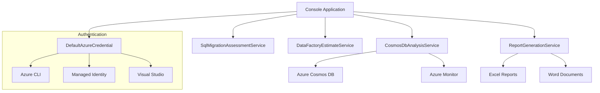

# Cosmos DB to SQL Migration Assessment Tool

[](https://github.com/JoshLuedeman/cosmosdb-to-sql-migration-tool/actions/workflows/build.yml)
[](https://github.com/JoshLuedeman/cosmosdb-to-sql-migration-tool/actions/workflows/codeql.yml)
[](https://github.com/JoshLuedeman/cosmosdb-to-sql-migration-tool/actions/workflows/dependency-review.yml)
[](https://github.com/JoshLuedeman/cosmosdb-to-sql-migration-tool/actions/workflows/secret-scan.yml)
[](https://github.com/JoshLuedeman/cosmosdb-to-sql-migration-tool/actions/workflows/performance-regression.yml)
[](SECURITY.md)
[](https://opensource.org/licenses/MIT)
[](https://dotnet.microsoft.com/)

A powerful C# console application for analyzing Azure Cosmos DB databases and generating comprehensive migration assessments for Azure SQL platforms. This tool provides detailed analysis, performance metrics, and actionable recommendations to help you plan and execute successful database migrations.

## ✨ Features

- 🔍 **Deep Cosmos DB Analysis** - Comprehensive database and container structure analysis
- 📊 **Performance Metrics** - 6-month historical performance data from Azure Monitor
- 🎯 **SQL Migration Assessment** - Detailed recommendations for Azure SQL Database, SQL Managed Instance, and SQL Server
- 🚀 **Migration Estimates** - Azure Data Factory migration time and cost calculations
- 📋 **Professional Reports** - Excel and Word documents with executive summaries and technical details
- 🔐 **Secure Authentication** - Azure credential-based authentication with multiple auth methods
- 🌐 **Multi-Database Support** - Analyze single databases or entire Cosmos DB accounts
- 📁 **Organized Output** - Timestamped folders with clear, professional naming conventions

## 🚀 Quick Start

### Option 1: Download Release (Recommended)
1. Download the latest release from [GitHub Releases](https://github.com/JoshLuedeman/cosmosdb-to-sql-migration-tool/releases)
2. Extract the ZIP file for your platform (Windows, Linux, or macOS)
3. Run the executable:

```bash
# Windows
.\CosmosToSqlMigrationTool.exe --endpoint "https://your-cosmos-account.documents.azure.com:443/" --database "your-database" --output "./reports"

# Linux/macOS
./CosmosToSqlMigrationTool --endpoint "https://your-cosmos-account.documents.azure.com:443/" --database "your-database" --output "./reports"
```

### Option 2: Build from Source
```bash
git clone https://github.com/JoshLuedeman/cosmosdb-to-sql-migration-tool.git
cd cosmosdb-to-sql-migration-tool
dotnet build --configuration Release
dotnet run -- --endpoint "https://your-cosmos-account.documents.azure.com:443/" --database "your-database" --output "./reports"
```

## 📋 Usage Examples

### Analyze a Single Database
```bash
dotnet run -- --endpoint "https://contoso-cosmos.documents.azure.com:443/" --database "ProductCatalog" --output "./reports"
```

### Analyze All Databases in a Cosmos DB Account
```bash
dotnet run -- --endpoint "https://contoso-cosmos.documents.azure.com:443/" --all-databases --output "./reports"
```

### Use with Azure Monitor Integration
```bash
dotnet run -- --endpoint "https://contoso-cosmos.documents.azure.com:443/" --database "ProductCatalog" --workspace-id "12345678-1234-1234-1234-123456789012" --subscription-id "87654321-4321-4321-4321-210987654321" --resource-group "rg-cosmos-prod" --cosmos-account "contoso-cosmos" --output "./reports"
```

### Display Help
```bash
dotnet run -- --help
```

## 🛡️ Production deployments

Running the assessment from your laptop with `az login` is fine for ad-hoc use. For automated or shared-environment runs (CI/CD agents, scheduled assessments, AKS jobs, App Service, Container Apps, VM/VMSS), follow:

- **[Production Hardening Guide](docs/production-hardening.md)** — managed-identity setup for each Azure compute host and the four role grants the tool needs at runtime
- **[Secrets Management](docs/secrets-management.md)** — Azure Key Vault patterns for the SQL deployment artifacts the tool generates (the runtime tool itself uses no non-Entra secrets)
- **[Custom RBAC role definitions](docs/security/rbac/README.md)** — least-privilege Cosmos data-plane, ARM, Monitor, and SQL deploy role JSON
- **[Secret Rotation and Audit Logging](docs/secret-rotation-and-audit.md)** — rotation runbooks plus diagnostic settings, Defender plans, and a KQL detection library
- **[Production-readiness checklist](docs/production-readiness-checklist.md)** — security-review gate that ties together the four guides above; walk it before every production rollout

## 📊 What You Get

The tool generates comprehensive reports in timestamped folders:

```
CosmosDB-Analysis_2024-01-15__14-30-45/
├── Executive-Summary.docx           # High-level migration overview
├── ProductCatalog-Analysis.xlsx     # Detailed Excel analysis
├── InventoryDB-Analysis.xlsx        # Additional database (if multiple)
└── Migration-Assessment.xlsx        # Cross-database summary
```

### Excel Reports Include:
- **Database Overview** - Structure, containers, and key metrics
- **Performance Analysis** - RU consumption, latency patterns, and throughput trends
- **Schema Analysis** - Document schemas and field usage patterns
- **SQL Recommendations** - Platform suggestions, service tiers, and pricing
- **Migration Mapping** - Container-to-table and field-to-column mappings
- **Index Recommendations** - Optimized indexing strategies for SQL
- **Cost Analysis** - Migration costs and ongoing SQL platform expenses

### Word Documents Include:
- **Executive Summary** - Business case and recommendation overview
- **Migration Strategy** - Phased approach and timeline recommendations
- **Risk Assessment** - Potential challenges and mitigation strategies
- **Next Steps** - Actionable recommendations for migration planning

## 🏗️ Architecture


```mermaid
graph TB
    A[Console Application] --> B[CosmosDbAnalysisService]
    A --> C[SqlMigrationAssessmentService]
    A --> D[DataFactoryEstimateService]
    A --> E[ReportGenerationService]
    
    B --> F[Azure Cosmos DB]
    B --> G[Azure Monitor]
    
    E --> H[Excel Reports]
    E --> I[Word Documents]
    
    subgraph "Authentication"
        J[DefaultAzureCredential]
        K[Azure CLI]
        L[Managed Identity]
        M[Visual Studio]
    end
    
    A --> J
    J --> K
    J --> L
    J --> M
```

## 🔧 Prerequisites

### Required
- **.NET 8.0** or later
- **Azure subscription** with access to:
  - Azure Cosmos DB account
  - Azure Active Directory (for authentication)

### Recommended for Enhanced Analysis
- **Azure Monitor/Log Analytics workspace** (for detailed 6-month performance metrics)
- **Azure CLI** installed and authenticated

### Azure Permissions
The tool requires specific Azure permissions to access resources. See the [Azure Permissions Guide](docs/azure-permissions.md) for complete setup instructions.

**Quick Reference** (full details in [Production Hardening Guide](docs/production-hardening.md)):
- **Cosmos DB (data plane)**: `Cosmos DB Built-in Data Reader` — the NoSQL SDK constructed with `TokenCredential` needs this; ARM `Cosmos DB Account Reader` alone is not sufficient
- **Cosmos DB (control plane)**: `Reader` on the account or its resource group
- **Azure Monitor**: `Log Analytics Reader` on the workspace, `Monitoring Reader` on the resource group

### Authentication Options
The tool supports multiple authentication methods through Azure DefaultAzureCredential:
1. **Azure CLI** - `az login` (recommended for development)
2. **Managed Identity** - For deployment in Azure
3. **Visual Studio** - Integrated authentication
4. **Environment Variables** - Service principal credentials
5. **Interactive Browser** - Fallback authentication

## 📚 Documentation

- 📖 [Getting Started Guide](docs/getting-started.md)
- 🔐 [Azure Permissions & Requirements](docs/azure-permissions.md)
- 🎯 [Usage Examples](docs/usage.md)
- ⚙️ [Configuration Options](docs/configuration.md)
- 🏗️ [Architecture Details](docs/architecture.md)
- 🔧 [Troubleshooting](docs/troubleshooting.md)
- ⚡ [Performance Benchmarks](tests/Performance/CosmosToSqlAssessment.Benchmarks/README.md)

## 🤝 Contributing

We welcome contributions! Please see our [Contributing Guide](CONTRIBUTING.md) for details on:
- Setting up the development environment
- Coding standards and best practices
- Testing guidelines
- Submitting pull requests

## 📝 Command-Line Reference

```
Usage: CosmosToSqlMigrationTool [options]

Options:
  --endpoint <endpoint>                  Cosmos DB account endpoint URL (required)
  --database <database>                  Database name to analyze
  --all-databases                       Analyze all databases in the account
  --workspace-id <workspace-id>          Azure Monitor Log Analytics workspace ID
  --subscription-id <subscription-id>    Azure subscription ID
  --resource-group <resource-group>      Resource group name
  --cosmos-account <cosmos-account>      Cosmos DB account name
  --output <output>                      Output directory for reports
  --help                                 Show help information
```

## 🚨 Troubleshooting

### Common Issues

**Authentication Failed**
```bash
# Ensure you're logged in to Azure CLI
az login
az account show
```

**Database Not Found**
```bash
# List available databases first
az cosmosdb sql database list --account-name "your-account" --resource-group "your-rg"
```

**Permission Denied**
- Ensure your account has **Cosmos DB Account Reader** role
- For Azure Monitor integration, ensure **Log Analytics Reader** role
- See the [Azure Permissions Guide](docs/azure-permissions.md) for detailed setup

For more issues, see our [Troubleshooting Guide](docs/troubleshooting.md).

## 📄 License

This project is licensed under the MIT License - see the [LICENSE](LICENSE) file for details.

## 🎯 Use Cases

### Enterprise Migration Planning
Perfect for organizations planning large-scale migrations from Cosmos DB to Azure SQL platforms. Provides detailed cost analysis, performance projections, and risk assessments.

### Performance Optimization
Use historical performance data to optimize SQL configurations and identify potential bottlenecks before migration.

### Compliance and Governance
Generate professional reports for compliance reviews and governance approvals with detailed technical specifications.

### Development Teams
Help development teams understand the impact of schema changes and migration complexity with detailed mapping documentation.

---

**Made with ❤️ for the Azure community**

*If this tool helps with your migration project, please consider giving it a ⭐ star!*
    "OutputDirectory": "./Reports",
    "GenerateExcel": true,
    "GenerateWord": true,
    "IncludeDetailedMapping": true
  }
}
```

### 3. Authentication Setup

The application uses Azure Default Credential, supporting multiple authentication methods:

1. **Visual Studio**: Sign in through Visual Studio
2. **Azure CLI**: Run `az login`
3. **Azure PowerShell**: Run `Connect-AzAccount`
4. **Environment Variables**: Set `AZURE_CLIENT_ID`, `AZURE_CLIENT_SECRET`, `AZURE_TENANT_ID`

## 🚀 Usage

### Basic Execution
```bash
dotnet run
```

### With Specific Configuration
```bash
dotnet run --environment Production
```

## 📊 Output

The tool generates several outputs:

### 1. Console Output
- Real-time progress updates
- Key findings and recommendations
- Error messages and warnings

### 2. Excel Report (`CosmosToSQL_Assessment_YYYYMMDD_HHMMSS.xlsx`)
- **Executive Summary**: High-level findings and recommendations
- **Cosmos DB Analysis**: Performance metrics and container details
- **Container Details**: Detailed schema and structure analysis
- **Migration Mapping**: Complete source-to-target mapping
- **Index Recommendations**: SQL index recommendations with priorities
- **Data Factory Estimates**: Detailed migration time and cost breakdown
- **Recommendations**: Categorized recommendations with action items
- **Raw Data**: JSON export for further analysis

### 3. Word Report (`CosmosToSQL_ExecutiveSummary_YYYYMMDD_HHMMSS.docx`)
- Executive summary for stakeholders
- Key findings and recommendations
- Migration approach overview

## 🏆 Best Practices Implementation

### Security
- **Azure AD Authentication**: No hardcoded credentials
- **Managed Identity Support**: Enterprise-ready authentication
- **Least Privilege Access**: Minimal required permissions
- **Secure Connection**: All Azure SDK connections use HTTPS/TLS

### Performance
- **Efficient Querying**: Optimized Cosmos DB queries with pagination
- **Parallel Processing**: Concurrent container analysis where possible
- **Memory Management**: Proper resource disposal and cleanup
- **Caching**: Strategic caching of configuration and metadata

### Reliability
- **Retry Logic**: Exponential backoff for transient failures
- **Comprehensive Logging**: Structured logging throughout the application
- **Error Handling**: Graceful error handling with detailed error messages
- **Cancellation Support**: Proper cancellation token usage

### Monitoring
- **Performance Metrics**: Integration with Azure Monitor
- **Application Insights**: Optional enhanced telemetry
- **Progress Tracking**: Real-time progress updates
- **Health Checks**: Configuration validation before execution

## 🔍 Analysis Capabilities

### Cosmos DB Analysis
- **Schema Discovery**: Automatically detects document schemas and variations
- **Performance Metrics**: 6-month historical RU consumption and latency analysis
- **Index Analysis**: Evaluates indexing policies and effectiveness
- **Partition Analysis**: Identifies hot partitions and optimization opportunities
- **Query Pattern Analysis**: Analyzes top queries for optimization insights

### SQL Migration Assessment
- **Platform Selection**: Intelligent Azure SQL platform recommendations
- **Schema Mapping**: Detailed field-level mapping with type conversion
- **Index Strategy**: SQL index recommendations based on Cosmos DB usage
- **Complexity Assessment**: Migration complexity evaluation with risk factors
- **Transformation Rules**: Data transformation requirements and logic

### Data Factory Optimization
- **Performance Tuning**: Optimal DIU and parallel copy recommendations
- **Cost Optimization**: Detailed cost analysis and optimization suggestions
- **Timeline Estimation**: Realistic migration duration estimates
- **Regional Considerations**: Network and latency impact analysis

## ⚡ Performance & Benchmarking

The repository ships a BenchmarkDotNet harness under
[`tests/Performance/CosmosToSqlAssessment.Benchmarks/`](tests/Performance/CosmosToSqlAssessment.Benchmarks/README.md)
that covers the three hot paths in the assessment pipeline:

- **Cosmos analysis** — JSON schema discovery, type mapping, array shape detection.
- **SQL assessment** — the 8-phase migration-recommendation pipeline.
- **Report generation** — Excel (ClosedXML) + Word (OpenXml) writes to disk.

CI runs the harness on every PR to `main` and on every push to `main` that touches
perf-relevant code (see the
[`Performance Regression` workflow](.github/workflows/performance-regression.yml)).
A regression-detection step compares each run against a tracked baseline; the job
fails when any benchmark exceeds the configured tolerance. The harness's
operational deep dive — quickstart, baseline schema, exit codes, CI seed/refresh
workflow — lives in the [benchmarks project README](tests/Performance/CosmosToSqlAssessment.Benchmarks/README.md).

### Running benchmarks locally

> ⚠️ Always run benchmarks with `-c Release`. BenchmarkDotNet refuses to run a Debug build.

List every benchmark:

```bash
dotnet run -c Release \
  --project tests/Performance/CosmosToSqlAssessment.Benchmarks/CosmosToSqlAssessment.Benchmarks.csproj \
  -- --list flat
```

Smoke check (single warmup + single iteration, seconds not minutes):

```bash
dotnet run -c Release \
  --project tests/Performance/CosmosToSqlAssessment.Benchmarks/CosmosToSqlAssessment.Benchmarks.csproj \
  -- --filter "*SmokeBenchmarks*" --job dry --warmupCount 1 --iterationCount 1
```

Real measurement (matches the CI configuration — minutes per benchmark class):

```bash
dotnet run -c Release \
  --project tests/Performance/CosmosToSqlAssessment.Benchmarks/CosmosToSqlAssessment.Benchmarks.csproj \
  -- --filter "*"
```

### Indicative allocation envelopes

> The CI-enforced regression budgets live in
> [`baselines/baseline.json`](tests/Performance/CosmosToSqlAssessment.Benchmarks/baselines/baseline.json),
> seeded from representative CI runs (#234). The table below is a **bootstrap
> sizing guide, not an SLO** — values are from single-iteration dry runs during
> initial development, rounded to one significant figure, and intended to give a
> sense of order of magnitude.

**Why allocated bytes and not mean?** Cosmos analysis is allocation-bound
(JsonDocument parsing); SQL assessment and report generation are I/O-bound.
Mean numbers vary significantly across hardware and shared-runner load, which
makes them misleading to publish as project-wide targets. The harness still
tracks mean against the seeded baseline; the `compare-baseline` CLI flags
regressions on both axes.

| Benchmark class | Scope | Allocated (Small → Medium → Large) | Notes |
|---|---|---|---|
| `SmokeBenchmarks.BuildAssessmentResult` | model construction | ~4 KB | not parameterised |
| `CosmosAnalysisBenchmarks.ExtractFieldsFlat_Document` | flat-doc field extraction | ~4 KB → ~10 KB → ~20 KB | scales linearly |
| `CosmosAnalysisBenchmarks.MapJsonTypeToSqlTypeEnhanced_Primitives` | type-mapping micro | constant, small | `OperationsPerInvoke=11` |
| `CosmosAnalysisBenchmarks.AnalyzeArrayStructure_Tags` | tag-array shape | constant, small | not parameterised |
| `CosmosAnalysisBenchmarks.AnalyzeArrayStructure_Objects` | object-array shape | constant, small | not parameterised |
| `CosmosAnalysisBenchmarks.GetRecommendedSqlType_Mixed` | type-recommendation | constant, small | not parameterised |
| `SqlAssessmentBenchmarks.AssessMigrationAsync_EndToEnd` | full SQL assessment | ~40 KB → ~250 KB → ~1 MB | 8-phase orchestration |
| `SqlAssessmentBenchmarks.GenerateIndexScript_Bank` | index DDL generation | constant, small | `OperationsPerInvoke=100` |
| `SqlAssessmentBenchmarks.SanitizeName_Bank` | identifier sanitisation | constant, small | `OperationsPerInvoke=100` |
| `ReportGenerationBenchmarks.GenerateAssessmentReportAsync_EndToEnd` | Excel + Word write | ~4 MB → ~30 MB → ~340 MB | I/O-bound; high variance |
| `ReportGenerationBenchmarks.SanitizeFileName_Bank` | filename sanitisation | constant, small | `OperationsPerInvoke=100` |
| `ReportGenerationBenchmarks.CreateValidWorksheetName_Bank` | worksheet-name validation | constant, small | `OperationsPerInvoke=100` |

### Regression detection

The `baselines/baseline.json` is seeded from real CI runs, so the regression
check is **live**: every PR to `main` and every perf-relevant push to `main` is
compared against it. To refresh it after an intentional perf change, run the
`Performance Regression` workflow with `update_baseline=true` from the Actions
tab, review the `refreshed-baseline` artifact, and commit it. See the
[benchmarks README's seeding/refreshing section](tests/Performance/CosmosToSqlAssessment.Benchmarks/README.md#seeding--refreshing-the-baseline)
for the full walkthrough.

The `compare-baseline` CLI fails a benchmark when:

- `actualMean > baselineMean × meanToleranceFactor`, **or**
- `actualAllocated > max(baselineAllocated × allocationToleranceFactor, baselineAllocated + allocationFloorBytes)`

Shipped defaults:

| Setting | Value | Purpose |
|---|---|---|
| `defaultToleranceFactor` | `1.10` | 10% headroom on both the mean and allocation axes for every benchmark, unless a per-axis override widens it. Satisfies the parent #79 ">10% degradation fails CI" criterion. |
| `defaultAllocationFloorBytes` | `1024` | Protects near-zero baselines from brittle alarms — an absolute +1 KB is always allowed on top of the percentage. |

Tolerances can be overridden per benchmark and, since #234, **independently per
axis** in `baselines/baseline.json`:

- `meanToleranceFactor` — widens only the wall-clock (mean) budget.
- `allocationToleranceFactor` — widens only the allocation budget.
- `toleranceFactor` — legacy shared override applied to both axes when an
  axis-specific value is absent.

Allocations are effectively deterministic on the runner (observed run-to-run
drift < 0.01%), so allocation stays pinned at the strict `1.10` default for
**every** benchmark — including the ones below. Only the noisier **mean** axis is
widened, for the I/O-bound macro-benchmarks and the GC-heavy memory-profile
patterns whose meaningful signal is allocation rather than wall-clock:

| Benchmark (all sizes) | `meanToleranceFactor` | Why |
|---|---|---|
| `ReportGenerationBenchmarks.GenerateAssessmentReportAsync_EndToEnd` | `1.50` | Writes 4.4 MB → 343 MB to disk; wall-clock swings with runner I/O contention (observed spread ≈ 1.19×). |
| `SqlAssessmentBenchmarks.AssessMigrationAsync_EndToEnd` | `1.20` | 8-phase orchestration macro; moderate timing variance (observed spread ≈ 1.13×). |
| `StreamingMemoryProfileBenchmarks.BufferedRetainAllPattern` (1000 & 10000 docs) | `1.30` | Deliberately buffers every document in memory as the allocation contrast to streaming; GC pressure makes wall-clock noisy (observed spread ≈ 1.13×). Allocation — the point of this benchmark — stays strict at `1.10`. |

Per-benchmark overrides are preserved across `--update` runs. The baseline is
seeded from the slower of two consecutive CI runs of the same commit
(`meanNs`/`allocatedBytes` = `max(run1, run2)`) so the check is not anchored to a
lucky-fast capture.

`compare-baseline` exit codes:

| Code | Meaning |
| --- | --- |
| `0` | All compared benchmarks within tolerance (an empty `benchmarks` map is a no-op pass). |
| `1` | At least one benchmark regressed. |
| `2` | Bad invocation, missing/malformed files, or baseline-vs-report key drift. |

### CI integration

The [`Performance Regression`](.github/workflows/performance-regression.yml)
workflow runs on:

- Every pull request targeting `main` (no `paths:` filter — keeps the required
  status check consistently reportable on every PR).
- Every push to `main` that touches the benchmarks project, the main project's
  services / models / SqlProject, the csproj/sln/`Program.cs`, or the workflow
  file itself.
- Manual `workflow_dispatch`, optionally with `update_baseline=true` to refresh
  the tracked baseline (uploaded as a `refreshed-baseline` artifact — no
  auto-commit; review and commit in a follow-up PR).

Every run uploads the full `BenchmarkDotNet.Artifacts/` directory (HTML, CSV,
JSON, log) as a `benchmark-artifacts` workflow artifact with 14-day retention.
The badge at the top of this README reflects the latest default-branch run;
immediately after the workflow first lands on `main` it may briefly show
"no status" until the first push-to-`main` run completes.

### Parent acceptance criteria status

Both parent #79 acceptance criteria that were initially deferred are now
satisfied. Each had a dedicated follow-up issue so the path stayed traceable:

- ✅ **>10% degradation fails CI** — `defaultToleranceFactor` is `1.10`, seeded
  against a stable CI baseline captured from consecutive runs of the same commit
  (#234). Allocations stay strict at 10% for every benchmark; only the mean axis
  of the two I/O-bound macro-benchmarks is widened. Resolved by **#234**.
- ✅ **Benchmark results published to GitHub Pages** — the `publish-pages` job in
  the workflow pushes each `main` run's results to the `gh-pages` branch via
  `benchmark-action/github-action-benchmark`. Resolved by **#233**.

## 🛠️ Troubleshooting

### Common Issues

#### Authentication Errors
```
Error: Unable to authenticate to Azure
```
**Solution**: Ensure you're logged in via Azure CLI (`az login`) or Visual Studio

#### Cosmos DB Access Denied
```
Error: Forbidden (403) - Insufficient permissions
```
**Solution**: Ensure your account has Cosmos DB Data Reader role

#### Missing Performance Metrics
```
Warning: Azure Monitor not configured - performance metrics unavailable
```
**Solution**: Configure Azure Monitor workspace ID in appsettings.json

#### Report Generation Errors
```
Error: Access denied to output directory
```
**Solution**: Ensure the application has write permissions to the Reports directory

### Configuration Validation

The application performs comprehensive configuration validation on startup:
- Validates Cosmos DB connection parameters
- Checks Azure Monitor configuration
- Verifies output directory permissions
- Tests authentication credentials

## 📈 Extending the Tool

The application is designed for extensibility:

### Adding New Analysis Features
1. Create new methods in `CosmosDbAnalysisService`
2. Update the `CosmosDbAnalysis` model
3. Add corresponding report sections

### Custom Report Formats
1. Implement new methods in `ReportGenerationService`
2. Add configuration options for new formats
3. Update the main program logic

### Additional Azure Services
1. Add new service classes following the existing pattern
2. Register services in dependency injection
3. Update the assessment orchestration

## 📝 License

This project is licensed under the MIT License. See the LICENSE file for details.

## 🤝 Contributing

Contributions are welcome! Please read the contributing guidelines and submit pull requests for any improvements.

## 📞 Support

For issues and questions:
1. Check the troubleshooting section
2. Review application logs
3. Create an issue with detailed error information

## 🔄 Version History

### v1.0.0
- Initial release with comprehensive Cosmos DB analysis
- SQL migration assessment with Azure best practices
- Data Factory estimates and optimization
- Excel and Word report generation
