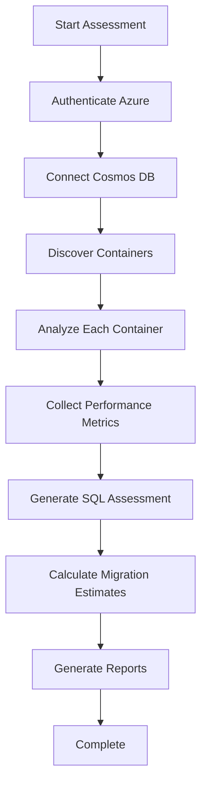
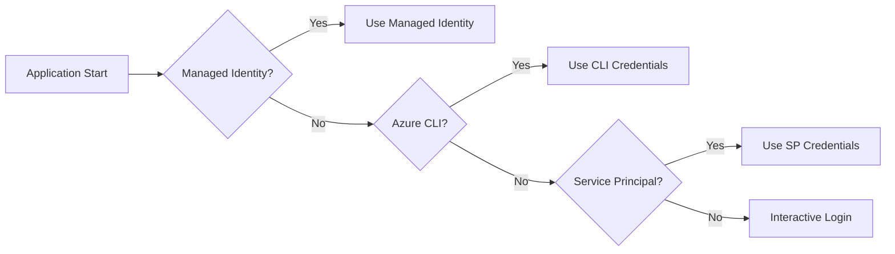

# Architecture Overview

## System Architecture

The Cosmos DB to SQL Migration Assessment Tool follows a layered, service-oriented architecture designed for maintainability, testability, and enterprise-grade reliability.

```
┌─────────────────────────────────────────────────────────────┐
│                     Presentation Layer                      │
├─────────────────────────────────────────────────────────────┤
│  Program.cs (Console Interface & Orchestration)            │
│  • Command-line argument parsing                           │
│  • User interaction and progress display                   │
│  • Exception handling and logging                          │
└─────────────────────────────────────────────────────────────┘
                                │
┌─────────────────────────────────────────────────────────────┐
│                     Service Layer                          │
├─────────────────────────────────────────────────────────────┤
│  CosmosDbAnalysisService                                   │
│  • Container discovery and analysis                        │
│  • Document schema detection                               │
│  • Performance metrics collection                          │
├─────────────────────────────────────────────────────────────┤
│  SqlMigrationAssessmentService                             │
│  • Azure SQL platform recommendations                      │
│  • Cost estimation and sizing                              │
│  • Migration complexity analysis                           │
├─────────────────────────────────────────────────────────────┤
│  DataFactoryEstimateService                                │
│  • Migration time calculations                             │
│  • Resource requirement estimation                         │
│  • Cost optimization recommendations                       │
├─────────────────────────────────────────────────────────────┤
│  ReportGenerationService                                   │
│  • Excel report generation (ClosedXML)                     │
│  • Word document creation (OpenXML)                        │
│  • Multi-format output support                             │
└─────────────────────────────────────────────────────────────┘
                                │
┌─────────────────────────────────────────────────────────────┐
│                     Data Models                            │
├─────────────────────────────────────────────────────────────┤
│  CosmosModels.cs                                           │
│  • AssessmentResult, CosmosDbAnalysis                      │
│  • ContainerAnalysis, PerformanceMetrics                   │
│  • DocumentSchema, FieldInfo                               │
├─────────────────────────────────────────────────────────────┤
│  SqlModels.cs                                              │
│  • SqlMigrationAssessment, DatabaseMapping                 │
│  • IndexRecommendation, MigrationComplexity                │
│  • TransformationRule, FieldMapping                        │
└─────────────────────────────────────────────────────────────┘
                                │
┌─────────────────────────────────────────────────────────────┐
│                Infrastructure Layer                        │
├─────────────────────────────────────────────────────────────┤
│  Azure SDK Integration                                      │
│  • Microsoft.Azure.Cosmos (Cosmos DB)                      │
│  • Azure.Identity (Authentication)                         │
│  • Azure.Monitor.Query (Metrics)                           │
├─────────────────────────────────────────────────────────────┤
│  Microsoft.Extensions Framework                            │
│  • Configuration Management                                │
│  • Dependency Injection                                    │
│  • Logging and Diagnostics                                 │
└─────────────────────────────────────────────────────────────┘
```

## Design Principles

### 1. Separation of Concerns

Each service has a single, well-defined responsibility:

- **CosmosDbAnalysisService**: Pure Cosmos DB analysis
- **SqlMigrationAssessmentService**: SQL platform recommendations
- **DataFactoryEstimateService**: Migration planning
- **ReportGenerationService**: Output generation

### 2. Dependency Injection

All services are registered with the DI container:

```csharp
services.AddSingleton<CosmosDbAnalysisService>();
services.AddSingleton<SqlMigrationAssessmentService>();
services.AddSingleton<DataFactoryEstimateService>();
services.AddSingleton<ReportGenerationService>();
```

### 3. Command-Line Driven with Configuration Defaults

The application uses a **command-line first approach** with configuration file defaults:

```csharp
// Command-line arguments take precedence
var endpoint = options.EndpointUrl ?? configuration["CosmosDb:AccountEndpoint"];
var databaseName = options.DatabaseName ?? configuration["CosmosDb:DatabaseName"];

// Configuration provides optional/default settings
services.Configure<CosmosDbOptions>(
    configuration.GetSection("CosmosDb"));
services.Configure<AzureMonitorOptions>(
    configuration.GetSection("AzureMonitor"));
```

**Security Benefits:**
- No sensitive endpoints stored in configuration files
- Flexible deployment across environments
- Environment-specific settings via command line

### 4. Async/Await Pattern

All I/O operations are asynchronous:

```csharp
public async Task<CosmosDbAnalysis> AnalyzeAsync(
    string databaseName, 
    CancellationToken cancellationToken = default)
```

### 5. Error Handling Strategy

Layered exception handling:
- **Service Layer**: Business logic exceptions
- **Presentation Layer**: User-friendly error messages
- **Infrastructure**: Azure SDK exceptions

## Service Details

### CosmosDbAnalysisService

**Purpose**: Deep analysis of Cosmos DB structure and performance

**Key Methods**:
```csharp
Task<CosmosDbAnalysis> AnalyzeAsync(string databaseName)
Task<List<ContainerAnalysis>> AnalyzeContainersAsync(Database database)
Task<PerformanceMetrics> CollectPerformanceMetricsAsync(string accountName)
Task<List<DocumentSchema>> AnalyzeDocumentSchemasAsync(Container container)
```

**Dependencies**:
- `CosmosClient` (Azure Cosmos SDK)
- `LogsQueryClient` (Azure Monitor)
- `IConfiguration`
- `ILogger<CosmosDbAnalysisService>`

**Key Features**:
- Container discovery and metadata collection
- Statistical document sampling
- Performance metrics from Azure Monitor
- Schema inference with type detection
- Partition key effectiveness analysis

### SqlMigrationAssessmentService

**Purpose**: Generate intelligent SQL migration recommendations

**Key Methods**:
```csharp
Task<SqlMigrationAssessment> AssessAsync(CosmosDbAnalysis cosmosAnalysis)
Task<string> RecommendAzureSqlPlatform(WorkloadCharacteristics workload)
Task<List<IndexRecommendation>> GenerateIndexRecommendations(ContainerAnalysis container)
Task<MigrationComplexity> CalculateComplexity(CosmosDbAnalysis analysis)
```

**Decision Logic**:
- **Azure SQL Database**: For most OLTP workloads
- **SQL Managed Instance**: For complex migrations needing SQL Server features
- **SQL Server on VM**: For specialized requirements or lift-and-shift

**Complexity Factors**:
- Nested document structures
- Array fields requiring normalization
- Dynamic schemas
- Large document sizes
- Complex partition strategies

### DataFactoryEstimateService

**Purpose**: Calculate realistic migration timelines and costs

**Key Methods**:
```csharp
Task<DataFactoryEstimate> EstimateAsync(CosmosDbAnalysis cosmosAnalysis)
Task<TimeSpan> CalculateMigrationTime(long dataVolumeBytes, int parallelism)
Task<decimal> CalculateCost(TimeSpan duration, int dius)
Task<int> RecommendDIUs(long dataVolumeBytes, TimeSpan targetDuration)
```

**Estimation Factors**:
- **Data Volume**: Total bytes to transfer
- **Data Complexity**: Transformation overhead
- **Network Throughput**: Regional bandwidth
- **Parallelism**: Concurrent copy activities
- **DIU Efficiency**: Data Integration Unit utilization

### ReportGenerationService

**Purpose**: Generate professional Excel and Word reports

**Key Methods**:
```csharp
Task<(string ExcelPath, string WordPath)> GenerateAssessmentReportAsync(AssessmentResult result)
Task GenerateExcelReportAsync(AssessmentResult result, string filePath)
Task GenerateWordReportAsync(AssessmentResult result, string filePath)
```

**Report Features**:
- **Multi-worksheet Excel**: Executive summary, detailed analysis, metrics
- **Professional Word docs**: Executive-friendly summaries
- **Charts and visualizations**: Performance trends, cost breakdowns
- **Customizable templates**: Branding and corporate standards

## Data Flow

### 1. Assessment Workflow



### 2. Data Transformation Pipeline

```
Cosmos DB Documents → Schema Detection → SQL Table Design
                  ↓
Performance Metrics → Workload Analysis → Platform Sizing
                  ↓
Migration Planning → Cost Estimation → Executive Reports
```

### 3. Authentication Flow



## Extensibility Points

### 1. Custom Analysis Services

Implement `IAnalysisService` interface:

```csharp
public interface IAnalysisService
{
    Task<AnalysisResult> AnalyzeAsync(string target, CancellationToken cancellationToken);
}
```

### 2. Additional Report Formats

Extend `ReportGenerationService`:

```csharp
public async Task<string> GeneratePowerBIReportAsync(AssessmentResult result)
{
    // Custom Power BI template generation
}
```

### 3. Custom Metrics Collectors

Add new performance metric sources:

```csharp
public interface IMetricsCollector
{
    Task<PerformanceMetrics> CollectAsync(string resourceId, TimeSpan period);
}
```

### 4. Migration Strategy Providers

Implement different migration approaches:

```csharp
public interface IMigrationStrategyProvider
{
    Task<MigrationStrategy> GetStrategyAsync(MigrationContext context);
}
```

## Security Architecture

### 1. Authentication Layers

```
Application → Azure Identity → Azure AD → Resource Access
                    ↓
            [Token Caching]
                    ↓
            [Automatic Refresh]
```

### 2. Authorization Model

- **Cosmos DB**: DocumentDB Account Reader (minimum)
- **Azure Monitor**: Monitoring Reader
- **Resource Groups**: Reader (for discovery)

### 3. Data Protection

- **In Transit**: HTTPS/TLS for all Azure communications
- **At Rest**: Azure-managed encryption
- **In Memory**: Sensitive data cleared after use
- **Reports**: Optional encryption for generated files

## Performance Considerations

### 1. Cosmos DB Analysis

**Optimization Strategies**:
- Parallel container analysis
- Statistical sampling for large collections
- Efficient query patterns
- Connection pooling

**Bottlenecks**:
- Large document sampling
- Complex schema inference
- Network latency to Cosmos DB

### 2. Azure Monitor Queries

**Best Practices**:
- Time-bounded queries
- Efficient KQL queries
- Result pagination
- Query result caching

### 3. Report Generation

**Performance Tips**:
- Stream large datasets
- Async report generation
- Template-based formatting
- Compressed output files

## Deployment Architecture

### 1. Development Environment

```
Developer Machine
├── Visual Studio/VS Code
├── Azure CLI
├── .NET 8 SDK
└── Local Configuration
```

### 2. Azure Container Instance

```yaml
apiVersion: 2021-07-01
location: eastus
properties:
  containers:
  - name: cosmos-assessment
    properties:
      image: myregistry.azurecr.io/cosmos-assessment:latest
      resources:
        requests:
          cpu: 2
          memoryInGb: 4
      environmentVariables:
      - name: AZURE_CLIENT_ID
        secureValue: <managed-identity-id>
```

### 3. Azure App Service

```yaml
# azure-pipelines.yml for App Service deployment
- task: AzureWebApp@1
  inputs:
    azureSubscription: 'Azure-Service-Connection'
    appType: 'webAppLinux'
    appName: 'cosmos-assessment-app'
    deployToSlotOrASE: true
    slotName: 'staging'
    package: '$(System.ArtifactsDirectory)/**/*.zip'
```

## Monitoring and Observability

### 1. Application Insights Integration

```csharp
services.AddApplicationInsightsTelemetry();
services.AddLogging(builder => {
    builder.AddApplicationInsights();
});
```

### 2. Custom Metrics

```csharp
telemetryClient.TrackMetric("AssessmentDuration", duration.TotalMinutes);
telemetryClient.TrackMetric("ContainersAnalyzed", containerCount);
telemetryClient.TrackEvent("AssessmentCompleted", properties);
```

### 3. Health Checks

```csharp
services.AddHealthChecks()
    .AddCosmosDb(cosmosConnectionString)
    .AddAzureMonitor(monitorWorkspaceId);
```

## Testing Strategy

### 1. Unit Testing

- Service layer business logic
- Data model validation
- Configuration validation
- Report generation logic

### 2. Integration Testing

- Azure service connectivity
- End-to-end assessment flows
- Report output validation
- Performance benchmarking

### 3. Load Testing

- Large Cosmos DB assessments
- Concurrent analysis operations
- Memory usage patterns
- Azure service limits
