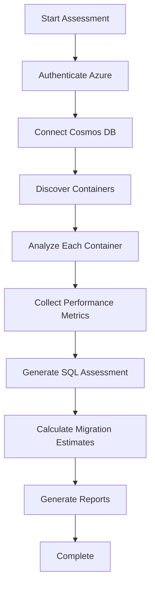
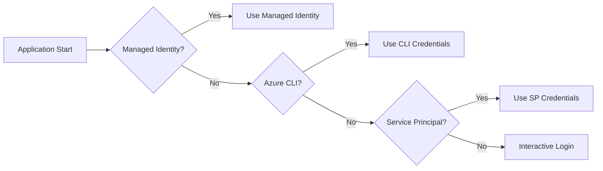
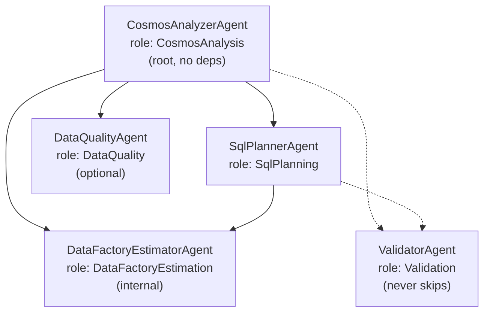
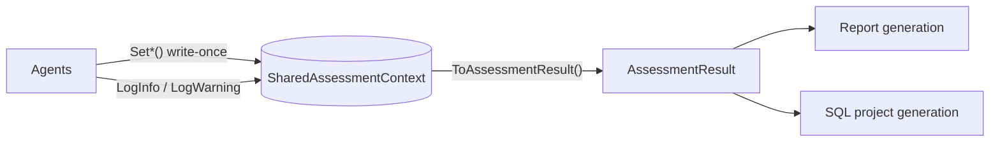
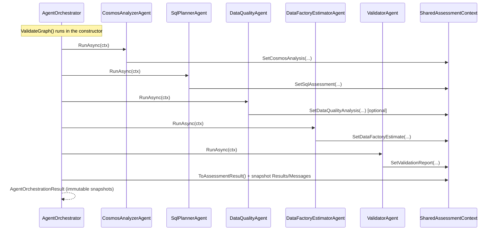
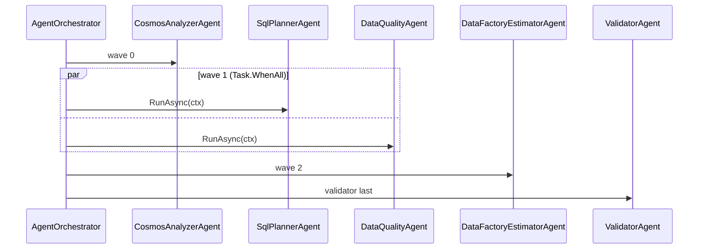
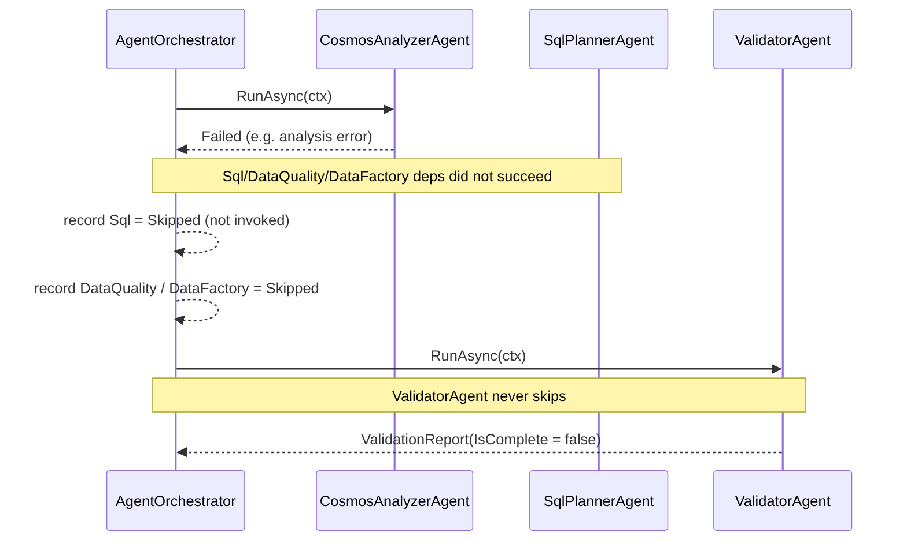

# Architecture Overview

## System Architecture

The Cosmos DB to SQL Migration Assessment Tool follows a layered, service-oriented architecture designed for maintainability, testability, and enterprise-grade reliability.

```
┌─────────────────────────────────────────────────────────────┐
│                     Presentation Layer                      │
├─────────────────────────────────────────────────────────────┤
│  Program.cs (Console Interface & Orchestration)            │
│  • Command-line argument parsing                           │
│  • User interaction and progress display                   │
│  • Exception handling and logging                          │
└─────────────────────────────────────────────────────────────┘
                                │
┌─────────────────────────────────────────────────────────────┐
│                     Service Layer                          │
├─────────────────────────────────────────────────────────────┤
│  CosmosDbAnalysisService                                   │
│  • Container discovery and analysis                        │
│  • Document schema detection                               │
│  • Performance metrics collection                          │
├─────────────────────────────────────────────────────────────┤
│  SqlMigrationAssessmentService                             │
│  • Azure SQL platform recommendations                      │
│  • Cost estimation and sizing                              │
│  • Migration complexity analysis                           │
├─────────────────────────────────────────────────────────────┤
│  DataFactoryEstimateService                                │
│  • Migration time calculations                             │
│  • Resource requirement estimation                         │
│  • Cost optimization recommendations                       │
├─────────────────────────────────────────────────────────────┤
│  ReportGenerationService                                   │
│  • Excel report generation (ClosedXML)                     │
│  • Word document creation (OpenXML)                        │
│  • Multi-format output support                             │
└─────────────────────────────────────────────────────────────┘
                                │
┌─────────────────────────────────────────────────────────────┐
│                     Data Models                            │
├─────────────────────────────────────────────────────────────┤
│  CosmosModels.cs                                           │
│  • AssessmentResult, CosmosDbAnalysis                      │
│  • ContainerAnalysis, PerformanceMetrics                   │
│  • DocumentSchema, FieldInfo                               │
├─────────────────────────────────────────────────────────────┤
│  SqlModels.cs                                              │
│  • SqlMigrationAssessment, DatabaseMapping                 │
│  • IndexRecommendation, MigrationComplexity                │
│  • TransformationRule, FieldMapping                        │
└─────────────────────────────────────────────────────────────┘
                                │
┌─────────────────────────────────────────────────────────────┐
│                Infrastructure Layer                        │
├─────────────────────────────────────────────────────────────┤
│  Azure SDK Integration                                      │
│  • Microsoft.Azure.Cosmos (Cosmos DB)                      │
│  • Azure.Identity (Authentication)                         │
│  • Azure.Monitor.Query (Metrics)                           │
├─────────────────────────────────────────────────────────────┤
│  Microsoft.Extensions Framework                            │
│  • Configuration Management                                │
│  • Dependency Injection                                    │
│  • Logging and Diagnostics                                 │
└─────────────────────────────────────────────────────────────┘
```

## Design Principles

### 1. Separation of Concerns

Each service has a single, well-defined responsibility:

- **CosmosDbAnalysisService**: Pure Cosmos DB analysis
- **SqlMigrationAssessmentService**: SQL platform recommendations
- **DataFactoryEstimateService**: Migration planning
- **ReportGenerationService**: Output generation

### 2. Dependency Injection

All services are registered with the DI container:

```csharp
services.AddSingleton<CosmosDbAnalysisService>();
services.AddSingleton<SqlMigrationAssessmentService>();
services.AddSingleton<DataFactoryEstimateService>();
services.AddSingleton<ReportGenerationService>();
```

### 3. Command-Line Driven with Configuration Defaults

The application uses a **command-line first approach** with configuration file defaults:

```csharp
// Command-line arguments take precedence
var endpoint = options.EndpointUrl ?? configuration["CosmosDb:AccountEndpoint"];
var databaseName = options.DatabaseName ?? configuration["CosmosDb:DatabaseName"];

// Configuration provides optional/default settings
services.Configure<CosmosDbOptions>(
    configuration.GetSection("CosmosDb"));
services.Configure<AzureMonitorOptions>(
    configuration.GetSection("AzureMonitor"));
```

**Security Benefits:**
- No sensitive endpoints stored in configuration files
- Flexible deployment across environments
- Environment-specific settings via command line

### 4. Async/Await Pattern

All I/O operations are asynchronous:

```csharp
public async Task<CosmosDbAnalysis> AnalyzeAsync(
    string databaseName, 
    CancellationToken cancellationToken = default)
```

### 5. Error Handling Strategy

Layered exception handling:
- **Service Layer**: Business logic exceptions
- **Presentation Layer**: User-friendly error messages
- **Infrastructure**: Azure SDK exceptions

## Service Details

### CosmosDbAnalysisService

**Purpose**: Deep analysis of Cosmos DB structure and performance

**Key Methods**:
```csharp
Task<CosmosDbAnalysis> AnalyzeAsync(string databaseName)
Task<List<ContainerAnalysis>> AnalyzeContainersAsync(Database database)
Task<PerformanceMetrics> CollectPerformanceMetricsAsync(string accountName)
Task<List<DocumentSchema>> AnalyzeDocumentSchemasAsync(Container container)
```

**Dependencies**:
- `CosmosClient` (Azure Cosmos SDK)
- `LogsQueryClient` (Azure Monitor)
- `IConfiguration`
- `ILogger<CosmosDbAnalysisService>`

**Key Features**:
- Container discovery and metadata collection
- Statistical document sampling
- Performance metrics from Azure Monitor
- Schema inference with type detection
- Partition key effectiveness analysis

### SqlMigrationAssessmentService

**Purpose**: Generate intelligent SQL migration recommendations

**Key Methods**:
```csharp
Task<SqlMigrationAssessment> AssessAsync(CosmosDbAnalysis cosmosAnalysis)
Task<string> RecommendAzureSqlPlatform(WorkloadCharacteristics workload)
Task<List<IndexRecommendation>> GenerateIndexRecommendations(ContainerAnalysis container)
Task<MigrationComplexity> CalculateComplexity(CosmosDbAnalysis analysis)
```

**Decision Logic**:
- **Azure SQL Database**: For most OLTP workloads
- **SQL Managed Instance**: For complex migrations needing SQL Server features
- **SQL Server on VM**: For specialized requirements or lift-and-shift

**Complexity Factors**:
- Nested document structures
- Array fields requiring normalization
- Dynamic schemas
- Large document sizes
- Complex partition strategies

### DataFactoryEstimateService

**Purpose**: Calculate realistic migration timelines and costs

**Key Methods**:
```csharp
Task<DataFactoryEstimate> EstimateAsync(CosmosDbAnalysis cosmosAnalysis)
Task<TimeSpan> CalculateMigrationTime(long dataVolumeBytes, int parallelism)
Task<decimal> CalculateCost(TimeSpan duration, int dius)
Task<int> RecommendDIUs(long dataVolumeBytes, TimeSpan targetDuration)
```

**Estimation Factors**:
- **Data Volume**: Total bytes to transfer
- **Data Complexity**: Transformation overhead
- **Network Throughput**: Regional bandwidth
- **Parallelism**: Concurrent copy activities
- **DIU Efficiency**: Data Integration Unit utilization

### ReportGenerationService

**Purpose**: Generate professional Excel and Word reports

**Key Methods**:
```csharp
Task<(string ExcelPath, string WordPath)> GenerateAssessmentReportAsync(AssessmentResult result)
Task GenerateExcelReportAsync(AssessmentResult result, string filePath)
Task GenerateWordReportAsync(AssessmentResult result, string filePath)
```

**Report Features**:
- **Multi-worksheet Excel**: Executive summary, detailed analysis, metrics
- **Professional Word docs**: Executive-friendly summaries
- **Charts and visualizations**: Performance trends, cost breakdowns
- **Customizable templates**: Branding and corporate standards

## Data Flow

### 1. Assessment Workflow


```mermaid
graph TD
    A[Start Assessment] --> B[Authenticate Azure]
    B --> C[Connect Cosmos DB]
    C --> D[Discover Containers]
    D --> E[Analyze Each Container]
    E --> F[Collect Performance Metrics]
    F --> G[Generate SQL Assessment]
    G --> H[Calculate Migration Estimates]
    H --> I[Generate Reports]
    I --> J[Complete]
```

### 2. Data Transformation Pipeline

```
Cosmos DB Documents → Schema Detection → SQL Table Design
                  ↓
Performance Metrics → Workload Analysis → Platform Sizing
                  ↓
Migration Planning → Cost Estimation → Executive Reports
```

### 3. Authentication Flow


```mermaid
graph LR
    A[Application Start] --> B{Managed Identity?}
    B -->|Yes| C[Use Managed Identity]
    B -->|No| D{Azure CLI?}
    D -->|Yes| E[Use CLI Credentials]
    D -->|No| F{Service Principal?}
    F -->|Yes| G[Use SP Credentials]
    F -->|No| H[Interactive Login]
```

## Extensibility Points

### 1. Custom Analysis Services

Implement `IAnalysisService` interface:

```csharp
public interface IAnalysisService
{
    Task<AnalysisResult> AnalyzeAsync(string target, CancellationToken cancellationToken);
}
```

### 2. Additional Report Formats

Extend `ReportGenerationService`:

```csharp
public async Task<string> GeneratePowerBIReportAsync(AssessmentResult result)
{
    // Custom Power BI template generation
}
```

### 3. Custom Metrics Collectors

Add new performance metric sources:

```csharp
public interface IMetricsCollector
{
    Task<PerformanceMetrics> CollectAsync(string resourceId, TimeSpan period);
}
```

### 4. Migration Strategy Providers

Implement different migration approaches:

```csharp
public interface IMigrationStrategyProvider
{
    Task<MigrationStrategy> GetStrategyAsync(MigrationContext context);
}
```

## Security Architecture

### 1. Authentication Layers

```
Application → Azure Identity → Azure AD → Resource Access
                    ↓
            [Token Caching]
                    ↓
            [Automatic Refresh]
```

### 2. Authorization Model

- **Cosmos DB**: DocumentDB Account Reader (minimum)
- **Azure Monitor**: Monitoring Reader
- **Resource Groups**: Reader (for discovery)

### 3. Data Protection

- **In Transit**: HTTPS/TLS for all Azure communications
- **At Rest**: Azure-managed encryption
- **In Memory**: Sensitive data cleared after use
- **Reports**: Optional encryption for generated files

## Performance Considerations

### 1. Cosmos DB Analysis

**Optimization Strategies**:
- Parallel container analysis
- Statistical sampling for large collections
- Efficient query patterns
- Connection pooling

**Bottlenecks**:
- Large document sampling
- Complex schema inference
- Network latency to Cosmos DB

### 2. Azure Monitor Queries

**Best Practices**:
- Time-bounded queries
- Efficient KQL queries
- Result pagination
- Query result caching

### 3. Report Generation

**Performance Tips**:
- Stream large datasets
- Async report generation
- Template-based formatting
- Compressed output files

---

## Multi-Agent Orchestration Layer (Agentic Mode)

> Foundation of the M4 agentic-intelligence epic (#130, parent #131). This layer is **opt-in** via the
> `--agentic` CLI flag and produces output **equivalent** to the default single-pass flow described above —
> it changes *how* the per-database assessment is computed, not *what* is produced.

### Motivation

The single-pass flow runs a fixed sequence (Cosmos → SQL → data quality → Data Factory) inline in
`AssessmentOrchestrator`. The agentic layer re-expresses that same work as a set of **autonomous agents**
that each own one domain, declare their dependencies, and communicate only through a shared, thread-safe
**blackboard** (`SharedAssessmentContext`). A coordinator (`AgentOrchestrator`) schedules them with
failure isolation, optional parallelism, and an always-on validation pass. This makes the pipeline
composable and independently testable, and gives downstream issues (#132/#133/#69) a stable surface to
build richer agentic behaviour on.

The agents **wrap the existing services without changing their signatures**, so the analysis logic — and
the streaming behaviour from #129 — is reused verbatim.

### Stable public surface

Everything below lives in namespace `CosmosToSqlAssessment.Agents`. The **public interfaces, records, and
result types — together with the documented invariants** — form the stable surface that #132/#133/#69 build
on. Internal wiring (DI registration) and the `internal` `DataFactoryEstimatorAgent` are implementation
details and are **not** extension points.

| Type | Kind | Responsibility |
|---|---|---|
| `IAssessmentAgent` | interface | An agent: `Name`, `Role` (`AgentRole`), `Dependencies` (`IReadOnlyCollection<AgentRole>`), `RunAsync(ISharedAssessmentContext, CancellationToken)` → `AgentResult`. |
| `AssessmentAgentBase` | abstract base | Shared lifecycle: times the run, records an `AgentResult`, converts exceptions to **`Failed`** results (isolation), **rethrows `OperationCanceledException`**, and exposes a `GetSkipReason` hook that yields a **`Skipped`** result. |
| `ISharedAssessmentContext` / `SharedAssessmentContext` | blackboard | Thread-safe (single lock) shared state: **write-once** domain outputs + **write-once** `ValidationReport`, a message log, a per-agent result log, `GetMissingRequiredOutputs()`, and `ToAssessmentResult()`. |
| `AgentOrchestrator` | coordinator | Validates the agent graph in its constructor, then `RunAsync(databaseName, cosmosAccountName, options?, ct)` → `AgentOrchestrationResult`. |
| `AgentOrchestrationOptions` | record | `Mode` (`AgentExecutionMode`, default `Sequential`) and an optional cooperative `PerAgentTimeout`. |
| `AgentOrchestrationResult` | record | **Immutable snapshots only** (see below). |
| `AgentMessage` / `AgentResult` | records | A logged message (`AgentName`, `Level`, `Text`, `TimestampUtc`) and a terminal agent outcome (`AgentName`, `Role`, `Status`, `Error?`, `Duration`). |
| `ValidationReport` / `ValidationFinding` | records | The validator's typed verdict and individual cross-check findings. |
| `AgentRole` / `AgentMessageLevel` / `AgentRunStatus` / `AgentExecutionMode` / `ValidationFindingCategory` | enums | Domain role, severity, terminal status, scheduling mode, and finding category. |

> **Snapshot contract.** `AgentOrchestrationResult` exposes only **immutable point-in-time snapshots**
> (the projected `AssessmentResult`, the `ValidationReport`, the `AgentResults` and `Messages` lists,
> `IsAcceptable`, and `Mode`). The live mutable `SharedAssessmentContext` is intentionally **not** surfaced —
> consumers must not expect to observe or mutate the context after a run. The stable downstream artifact is
> the projected legacy `AssessmentResult`.

### Agent roster & dependency graph


```mermaid
flowchart TD
    C["CosmosAnalyzerAgent<br/>role: CosmosAnalysis<br/>(root, no deps)"]
    S["SqlPlannerAgent<br/>role: SqlPlanning"]
    Q["DataQualityAgent<br/>role: DataQuality<br/>(optional)"]
    F["DataFactoryEstimatorAgent<br/>role: DataFactoryEstimation<br/>(internal)"]
    V["ValidatorAgent<br/>role: Validation<br/>(never skips)"]

    C --> S
    C --> Q
    C --> F
    S --> F
    C -.-> V
    S -.-> V
```

Each agent wraps an unchanged service: `CosmosAnalyzerAgent` → `CosmosDbAnalysisService`,
`SqlPlannerAgent` → `SqlMigrationAssessmentService`, `DataQualityAgent` → `DataQualityAnalysisService`,
`DataFactoryEstimatorAgent` → `DataFactoryEstimateService`. The `ValidatorAgent` produces no domain output;
it cross-checks the others.

#### Required vs optional outputs

Completeness and the CLI's fatal semantics are driven entirely by the **required** outputs:

| Output | Required for completeness? | Produced by |
|---|:--:|---|
| `CosmosAnalysis` | ✅ Yes | `CosmosAnalyzerAgent` |
| `SqlAssessment` | ✅ Yes | `SqlPlannerAgent` |
| `DataFactoryEstimate` | ✅ Yes | `DataFactoryEstimatorAgent` |
| `DataQualityAnalysis` | ❌ No (optional) | `DataQualityAgent` |
| `ValidationReport` | n/a — always emitted | `ValidatorAgent` |

An absent or failed `DataQualityAgent` is **non-fatal** and is reported diagnostically; it never affects
completeness unless deliberately promoted to a required output.

### Shared context & data flow


```mermaid
flowchart LR
    A1[Agents] -- "Set*() write-once" --> CTX[(SharedAssessmentContext)]
    A1 -- "LogInfo / LogWarning" --> CTX
    CTX -- "ToAssessmentResult()" --> AR[AssessmentResult]
    AR --> RPT[Report generation]
    AR --> SQLPROJ[SQL project generation]
```

Agents commit their domain output to the context as their **last action**, so a later failure never leaves a
half-populated context. The context projects to the legacy `AssessmentResult` via `ToAssessmentResult()`,
which is fed to the **unchanged** report and SQL-project generation — this reuse is what guarantees
equivalence with single-pass output. Agents that wrap data-heavy services **preserve the services' internal
streaming / `IAsyncEnumerable` semantics** (#129); the orchestration layer introduces no whole-dataset
buffering.

### Execution modes

The orchestrator separates **producers** (Cosmos, SQL, data quality, Data Factory) from the **validator**.
Producers are scheduled by mode; the validator always runs **last** (see invariants below). A producer's
role is *completed* once its agent records any terminal result, and a producer becomes *ready* when every
role in its `Dependencies` is completed.

#### Sequential (default, and what `--agentic` uses)

Runs the highest-priority **ready** producer one at a time, reproducing the exact single-pass order.


```mermaid
sequenceDiagram
    participant O as AgentOrchestrator
    participant C as CosmosAnalyzerAgent
    participant S as SqlPlannerAgent
    participant Q as DataQualityAgent
    participant F as DataFactoryEstimatorAgent
    participant V as ValidatorAgent
    participant X as SharedAssessmentContext

    Note over O: ValidateGraph() runs in the constructor
    O->>C: RunAsync(ctx)
    C->>X: SetCosmosAnalysis(...)
    O->>S: RunAsync(ctx)
    S->>X: SetSqlAssessment(...)
    O->>Q: RunAsync(ctx)
    Q->>X: SetDataQualityAnalysis(...) [optional]
    O->>F: RunAsync(ctx)
    F->>X: SetDataFactoryEstimate(...)
    O->>V: RunAsync(ctx)
    V->>X: SetValidationReport(...)
    O->>X: ToAssessmentResult() + snapshot Results/Messages
    O-->>O: AgentOrchestrationResult (immutable snapshots)
```

#### Parallel (delta from Sequential)

The whole **ready wave** runs concurrently via `Task.WhenAll`; the validator is still held until all
producers complete. With the standard roster the waves are: **wave 0** = `Cosmos`; **wave 1** =
`{Sql, DataQuality}` concurrently (both depend only on Cosmos); **wave 2** = `DataFactory` (needs Sql);
then the **validator**.


```mermaid
sequenceDiagram
    participant O as AgentOrchestrator
    participant C as CosmosAnalyzerAgent
    participant S as SqlPlannerAgent
    participant Q as DataQualityAgent
    participant F as DataFactoryEstimatorAgent
    participant V as ValidatorAgent

    O->>C: wave 0
    par wave 1 (Task.WhenAll)
        O->>S: RunAsync(ctx)
    and
        O->>Q: RunAsync(ctx)
    end
    O->>F: wave 2
    O->>V: validator last
```

#### Conditional (delta from Sequential)

Sequential ordering, but a producer whose dependencies did **not succeed** is recorded **`Skipped`
without being invoked**. The validator still runs and reports the resulting incompleteness.


```mermaid
sequenceDiagram
    participant O as AgentOrchestrator
    participant C as CosmosAnalyzerAgent
    participant S as SqlPlannerAgent
    participant V as ValidatorAgent

    O->>C: RunAsync(ctx)
    C-->>O: Failed (e.g. analysis error)
    Note over O,S: Sql/DataQuality/DataFactory deps did not succeed
    O-->>O: record Sql = Skipped (not invoked)
    O-->>O: record DataQuality / DataFactory = Skipped
    O->>V: RunAsync(ctx)
    Note over O,V: ValidatorAgent never skips
    V-->>O: ValidationReport(IsComplete = false)
```

#### Scheduling determinism

Sequential and Conditional schedule in **dependency-priority order** and are fully deterministic. In
**Parallel** mode, agents within a ready wave execute concurrently, so the relative order of their messages
and results is **not** semantically meaningful. Consumers should key off **role / result identity**, not
incidental log order. (The orchestrator snapshots the result and message lists so a returned
`AgentOrchestrationResult` is itself stable.)

### Failure isolation, validation & recoverability

- **Isolation.** An agent that throws is recorded as a `Failed` result; the run continues so other agents
  can still produce their outputs. `OperationCanceledException` is the exception — it is rethrown so global
  Ctrl+C cancellation propagates (and `Program` maps it to exit code 130).
- **Cooperative timeout.** `PerAgentTimeout` cancels a **linked** `CancellationToken`; it only bounds agents
  (and the services they wrap) that *observe* cancellation. A timed-out agent becomes a `Failed` result and
  the run continues. Long-running or streaming agents must propagate and honour the token and must not
  swallow cancellation.
- **The validator is an invariant, not a step.** `ValidatorAgent` **never skips** and runs **last in every
  mode**, even when producers failed or required outputs are missing. Its job is to convert partial
  orchestration state into a complete `ValidationReport`:
  - **Completeness** — `IsComplete` is true when no *required* output is missing (`MissingRequiredOutputs`
    empty). A missing required output yields a `Completeness`/`Error` finding.
  - **Consistency** — `IsConsistent` is true when there are no `Error`-level `Consistency` findings. An
    unmapped Cosmos container is a `Consistency`/`Error`; a container-count mismatch is a softer
    `Consistency`/`Warning`. Failed or absent optional agents produce `Diagnostic` findings only.
  - **Acceptability** — `IsAcceptable = IsComplete && IsConsistent`.

### Equivalence guarantee

Agentic mode is held to **output equivalence** with single-pass mode by regression tests
(`tests/CosmosToSqlAssessment.Tests/EndToEnd/AgentEquivalenceTests.cs`): driving the real services (against
the mock Azure SDKs) through the `AgentOrchestrator` produces an `AssessmentResult` that is field-for-field
equivalent to the legacy `E2EFixture.RunAssessmentAsync` baseline — in **both Sequential and Parallel**
modes — excluding only non-deterministic members (generated IDs and timestamps). Additional fake-agent
scheduling tests (`Agents/AgentOrchestratorTests.cs`) cover ordering, parallel waves, failure isolation,
conditional skip, timeout, and graph validation.

### CLI usage

```bash
# Run the assessment through the multi-agent orchestration layer (equivalent output)
CosmosToSqlAssessment --agentic --database MyDatabase

# Works with the usual flags
CosmosToSqlAssessment --agentic --all-databases --output C:\Reports
```

When `--agentic` is set, `AssessmentOrchestrator` computes each database's assessment through the
`AgentOrchestrator` (a **child DI scope per database**, explicit **Sequential** mode) and then feeds the same
unchanged report / SQL-project generation. **Fatal semantics match single-pass** and are expressed as an
invariant: the run fails only when it is **incomplete** (`ValidationReport.IsComplete == false`), i.e. a
*required* output is missing. A consistency-only finding (e.g. an unmapped container) and an absent/failed
optional data-quality analysis are **non-fatal**, exactly as in single-pass.

### Extensibility — adding an agent (for #132/#133/#69)

There is **exactly one agent per `AgentRole`**, and the orchestrator validates this at construction.

1. **Adding an agent for an existing role is not the model.** A new agent almost always introduces (or
   re-uses) a *distinct* role. Implement `IAssessmentAgent` (or derive from `AssessmentAgentBase` for the
   shared timing / isolation / skip lifecycle), set `Name`, `Role`, and `Dependencies`, and commit any
   domain output to the context **last** via a `Set*` method.
2. **Register it** in DI (`AddCosmosAssessment`) as `IAssessmentAgent`; the orchestrator discovers it via
   `IEnumerable<IAssessmentAgent>` and schedules it by its dependencies — no scheduler changes needed.
3. **Adding a new *role*** may additionally require updating: the graph-validation rules (which roles are
   required), the scheduling priority order, the validator's completeness/consistency expectations, and —
   if the agent produces a new domain output — `SharedAssessmentContext` and the `ToAssessmentResult()`
   projection.
4. **Model optional agents** so their absence or failure stays diagnostic and does **not** affect
   completeness, unless the new output is intentionally promoted to *required*.

Graph-validation rules the constructor enforces (violations throw `InvalidOperationException`): unique agent
names, exactly one agent per role, all required roles present, and no dependency on a role that no
registered agent provides.

## Deployment Architecture

### 1. Development Environment

```
Developer Machine
├── Visual Studio/VS Code
├── Azure CLI
├── .NET 8 SDK
└── Local Configuration
```

### 2. Azure Container Instance

```yaml
apiVersion: 2021-07-01
location: eastus
properties:
  containers:
  - name: cosmos-assessment
    properties:
      image: myregistry.azurecr.io/cosmos-assessment:latest
      resources:
        requests:
          cpu: 2
          memoryInGb: 4
      environmentVariables:
      - name: AZURE_CLIENT_ID
        secureValue: <managed-identity-id>
```

### 3. Azure App Service

```yaml
# azure-pipelines.yml for App Service deployment
- task: AzureWebApp@1
  inputs:
    azureSubscription: 'Azure-Service-Connection'
    appType: 'webAppLinux'
    appName: 'cosmos-assessment-app'
    deployToSlotOrASE: true
    slotName: 'staging'
    package: '$(System.ArtifactsDirectory)/**/*.zip'
```

## Monitoring and Observability

### 1. Application Insights Integration

```csharp
services.AddApplicationInsightsTelemetry();
services.AddLogging(builder => {
    builder.AddApplicationInsights();
});
```

### 2. Custom Metrics

```csharp
telemetryClient.TrackMetric("AssessmentDuration", duration.TotalMinutes);
telemetryClient.TrackMetric("ContainersAnalyzed", containerCount);
telemetryClient.TrackEvent("AssessmentCompleted", properties);
```

### 3. Health Checks

```csharp
services.AddHealthChecks()
    .AddCosmosDb(cosmosConnectionString)
    .AddAzureMonitor(monitorWorkspaceId);
```

## Testing Strategy

### 1. Unit Testing

- Service layer business logic
- Data model validation
- Configuration validation
- Report generation logic

### 2. Integration Testing

- Azure service connectivity
- End-to-end assessment flows
- Report output validation
- Performance benchmarking

### 3. Load Testing

- Large Cosmos DB assessments
- Concurrent analysis operations
- Memory usage patterns
- Azure service limits
