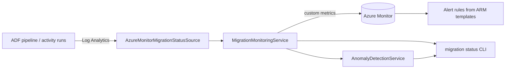

# Real-Time Monitoring and Alerting

This guide explains how to observe an in-flight Cosmos DB → Azure SQL migration in
real time, raise alerts when something goes wrong, and tune the behaviour to your
environment. It documents the monitoring subsystem delivered under parent issue
[#133](https://github.com/JoshLuedeman/cosmosdb-to-sql-migration-tool/issues/133).

The subsystem pairs with the Azure Data Factory pipelines the tool generates
([#70](https://github.com/JoshLuedeman/cosmosdb-to-sql-migration-tool/issues/70)) and reuses
the Azure Monitor credential/configuration surface introduced for metric auto-discovery
([#76](https://github.com/JoshLuedeman/cosmosdb-to-sql-migration-tool/issues/76)).

## Capability map

| Capability | What it does | Type namespace |
| --- | --- | --- |
| **Metric streaming** (#223) | Streams rows-migrated, RU consumption, and error-rate as Azure Monitor **custom metrics** while a migration runs. | `MigrationMonitoringService`, `AzureMonitorMetricPublisher` |
| **Alert rule templates** (#224) | Generates deployable ARM templates for metric/log alert rules (threshold breaches, error spikes, stalled pipelines). | `AlertRuleTemplateGenerationService`, `AlertRuleTemplateBuilder` |
| **`migration status` CLI** (#225) | Renders live migration progress in the console, optionally watching until cancelled. | `MigrationStatusService`, `AzureMonitorMigrationStatusSource` |
| **Anomaly detection** (#226) | Flags abnormal RU/throughput swings with a rolling-window z-score baseline, surfaced inline in `migration status`. | `AnomalyDetectionService` |

All of these read from, or write to, the **same** ADF pipeline/activity run telemetry, so a
single migration produces one coherent picture across metrics, alerts, the live CLI, and
anomaly warnings.



## Prerequisites

1. **.NET 9 SDK** and the built tool (`dotnet build`).
2. **Azure authentication** via `DefaultAzureCredential` — run `az login`, or supply a
   managed identity / service principal. See
   [Azure Permissions](azure-permissions.md) and
   [Production Hardening](production-hardening.md).
3. **Role assignments**:
   - *Reading* progress (CLI + anomaly detection) needs **Log Analytics Reader** /
     **Monitoring Reader** on the workspace that collects the ADF diagnostic logs. The
     bundled least-privilege role is in
     [`docs/security/rbac/cosmos-assessment-monitor-reader.json`](security/rbac/README.md).
   - *Publishing* custom metrics (#223) needs **Monitoring Metrics Publisher** on the
     target resource.
4. **ADF diagnostic settings** must forward `PipelineRuns` and `ActivityRuns` to the Log
   Analytics workspace so the `ADFPipelineRun` / `ADFActivityRun` tables are populated.

## Configuration reference

All settings live under the `AzureMonitor` root in `appsettings.json` (or any
`IConfiguration` source — environment variables, Key Vault, etc.). Every section is
optional; sensible defaults apply and nothing calls Azure unless explicitly enabled.

```jsonc
{
  "AzureMonitor": {
    // Log Analytics workspace (GUID) that collects ADF diagnostic logs.
    // Required for `migration status` to read live progress; when unset the
    // status source is a no-op and reports "No active migration progress found."
    "WorkspaceId": "00000000-0000-0000-0000-000000000000",

    // #223 — custom-metric ingestion (write surface). Disabled by default.
    "Metrics": {
      "Enabled": false,
      "Region": "eastus",
      "ResourceId": "/subscriptions/<sub>/resourceGroups/<rg>/providers/Microsoft.DataFactory/factories/<adf>",
      "MetricNamespace": "CosmosToSqlMigration",
      "IncludeRunIdDimension": false
    },

    // #225 — live status reader tuning.
    "Status": {
      "LookbackMinutes": 60
    },

    // #226 — anomaly detection on RU/throughput.
    "Anomaly": {
      "Enabled": true,
      "WindowSize": 20,
      "MinSamplesForBaseline": 5,
      "ZScoreThreshold": 3.0,
      "MinRelativeChange": 0.25,
      "MinBaselineStdDev": 1e-9,
      "WatchRequestUnits": true,
      "WatchThroughput": true,
      "SuppressLowOnTerminalStatus": true
    },

    // #224 — alert-rule ARM template generation (deploy-time artifacts only).
    "Alerts": {
      "MetricNamespace": "CosmosToSqlMigration",
      "Enabled": true,
      "EvaluationFrequency": "PT1M",
      "WindowSize": "PT5M",
      "StalledWindowSize": "PT15M",
      "StalledActivityGap": "15m",
      "ErrorRateThreshold": 0.05,
      "ErrorRateSeverity": 2,
      "ErrorSpikeSensitivity": "Medium",
      "ErrorSpikeNumberOfEvaluationPeriods": 4,
      "ErrorSpikeMinFailingPeriods": 3,
      "ErrorSpikeSeverity": 2,
      "IncludeLowThroughputAlert": true,
      "LowThroughputSeverity": 1,
      "IncludeRequestUnitsThresholdAlert": false,
      "RequestUnitsThreshold": 0,
      "RequestUnitsSeverity": 3,
      "StalledPipelineSeverity": 1,
      "SkipMetricValidation": true,
      "SkipQueryValidation": true
    }
  }
}
```

## Streaming progress metrics (#223)

`MigrationMonitoringService` consumes a stream of `MigrationProgressSample` values (one per
ADF activity observation), derives per-window and cumulative figures, and publishes custom
metrics through `IMigrationMetricPublisher`. The default `AzureMonitorMetricPublisher` POSTs
to the regional ingestion endpoint
`https://<region>.monitoring.azure.com<resourceId>/metrics` using `DefaultAzureCredential`.

### Published metrics

| Metric | Unit | Meaning |
| --- | --- | --- |
| `MigrationRowsMigrated` | Count | Rows migrated in the sample window. |
| `MigrationRequestUnitsConsumed` | Count | RU consumed in the sample window. |
| `MigrationErrorCount` | Count | Errors in the sample window. |
| `MigrationErrorRate` | Percent | Errors ÷ rows read for the window (0–1). |

Dimensions: `PipelineName`, `Status`, and (when present) `ActivityName`. `RunId` is **opt-in**
via `IncludeRunIdDimension` to avoid high-cardinality metric series.

### Enabling publishing

Publishing is **off by default** (`AzureMonitor:Metrics:Enabled = false`) so offline and CI
runs never call Azure. To turn it on, set `Enabled`, `Region`, and `ResourceId`. A
misconfigured or disabled publisher degrades to a no-op rather than failing the run; a
publish failure is logged and swallowed so it never aborts the migration stream.

## Alert rule ARM templates (#224, #256)

`AlertRuleTemplateGenerationService.GenerateAsync(outputDirectory)` writes deployable ARM
templates (and a README) under `<outputDirectory>/Monitoring/AlertRules/`. Run it from the CLI
with the additive subcommand:

```bash
CosmosToSqlAssessment migration generate-alerts --output C:\Reports
```

The command short-circuits the full assessment (no Cosmos endpoint required), writes the files
below, and prints each generated path plus any non-fatal warnings (e.g. a Request-Units alert
enabled with a non-positive threshold). It performs **no Azure calls** — generation is pure
local file I/O:

| File | Resource | Purpose |
| --- | --- | --- |
| `metric-alerts.template.json` | `Microsoft.Insights/metricAlerts` | Static error-rate breach, **dynamic** error-spike, low/no-throughput, and an optional RU ceiling — over the custom metrics from #223. |
| `stalled-pipeline-log-alert.template.json` | `Microsoft.Insights/scheduledQueryRules` (`LogAlert`) | KQL query over `ADFPipelineRun` / `ADFActivityRun` that fires when **no** activity progress is seen for `StalledActivityGap` — the reliable stalled-pipeline detector. |
| `README.md` | — | Per-template parameters and `az` deploy commands. |

Every tunable is emitted as an ARM **parameter default**, so the templates stay deployable
and overridable without regenerating them.

### Static vs dynamic thresholds

- The **error-rate** alert is a *static* threshold (`SingleResourceMultipleMetricCriteria`)
  — fires when the rate exceeds `ErrorRateThreshold` (default 5%). Use this when you know the
  acceptable ceiling.
- The **error-spike** alert is a *dynamic* threshold
  (`MultipleResourceMultipleMetricCriteria`) — Azure Monitor learns the metric's normal
  pattern and fires on statistically abnormal jumps. Tune via `ErrorSpikeSensitivity`,
  `ErrorSpikeNumberOfEvaluationPeriods`, and `ErrorSpikeMinFailingPeriods`. Use this when you
  cannot predict a fixed threshold.

`SkipMetricValidation` / `SkipQueryValidation` default to `true` so a template deploys before
the custom metrics or Log Analytics tables have been populated for the first time.

### Deploying

```bash
# Create or reuse an Action Group for notifications first, then:
az deployment group create \
  --resource-group <rg> \
  --template-file metric-alerts.template.json \
  --parameters actionGroupId=/subscriptions/<sub>/resourceGroups/<rg>/providers/microsoft.insights/actionGroups/<ag> \
               targetResourceId=/subscriptions/<sub>/resourceGroups/<rg>/providers/Microsoft.DataFactory/factories/<adf>

az deployment group create \
  --resource-group <rg> \
  --template-file stalled-pipeline-log-alert.template.json \
  --parameters actionGroupId=/subscriptions/<sub>/resourceGroups/<rg>/providers/microsoft.insights/actionGroups/<ag> \
               workspaceResourceId=/subscriptions/<sub>/resourceGroups/<rg>/providers/Microsoft.OperationalInsights/workspaces/<ws>
```

> **Note:** the templates are validated for JSON well-formedness and schema shape by the unit
> test suite; no live Azure deployment is required to produce them.

## Live progress: `migration status` (#225)

Report live migration progress directly in the console:

```bash
# One-shot snapshot
CosmosToSqlAssessment migration status

# Watch continuously, polling every 5 seconds, until Ctrl+C
CosmosToSqlAssessment migration status --watch --poll-interval 5
```

| Flag | Description | Default |
| --- | --- | --- |
| `--watch` | Continuously poll and re-render progress until cancelled. | off (single snapshot) |
| `--poll-interval <sec>` | Polling interval for `--watch`, in seconds. | 10 |

The command reads Copy-activity progress from the `ADFActivityRun` table in the workspace
named by `AzureMonitor:WorkspaceId`, diffs cumulative rows into per-window deltas, and prints
a line per observed pipeline/activity plus a summary. It is **read-only**: status derivation
uses a null metric publisher internally, so viewing progress never re-publishes metrics.

When `WorkspaceId` is unset the source is a no-op and the command prints
`No active migration progress found.` rather than attempting a network call.

Sample output:

```text
── Migration status ──
Migrate_Orders  rows=500  50.0%  ru/s=1180  err=0.0%  [InProgress]
  ⚠ anomaly: RequestUnitsPerSecond High value=4200 (z=6.4, baseline μ=1180, σ=190)
── Summary ──
Total rows migrated:  500
```

## Anomaly detection (#226)

`AnomalyDetectionService` watches the derived `RequestUnitsPerSecond` and
`ThroughputRowsPerSecond` series and flags abnormal swings, which `migration status` renders
inline as `⚠ anomaly` lines.

### How the baseline works

For each `(pipeline, run, activity, metric)` key the detector keeps a rolling window of the
most recent `WindowSize` observations. For every new value it:

1. Forms a baseline from the **prior** values in the window (a value never seeds its own
   baseline), once at least `MinSamplesForBaseline` exist.
2. Computes the sample mean and sample (n-1) standard deviation.
3. Flags the value when **both** of these hold:
   - `|z-score| ≥ ZScoreThreshold` (default 3.0), and
   - `relativeChange = |value − mean| / max(|mean|, ε) ≥ MinRelativeChange` (default 0.25).

The standard deviation is **floored** at `MinBaselineStdDev` so a perfectly flat baseline
doesn't divide by zero. The **relative-change guard** is what stops a near-constant series
from flapping on trivial noise while still catching genuine spikes and drops.

`Direction` is `High` (above baseline) or `Low` (below). When
`SuppressLowOnTerminalStatus` is `true` (default), `Low` anomalies are suppressed once a
run reaches a terminal status (`Succeeded`/`Failed`/`Cancelled`/`Completed`) so the natural
ramp-down at completion doesn't generate noise. `High` anomalies are always reported.

### Tuning

| Setting | Effect | Raise to… | Lower to… |
| --- | --- | --- | --- |
| `ZScoreThreshold` | Statistical strictness. | reduce false positives | catch subtler swings |
| `MinRelativeChange` | Minimum % move required. | ignore small wiggles | flag smaller changes |
| `WindowSize` | How much history forms the baseline. | smooth, slower to adapt | more reactive |
| `MinSamplesForBaseline` | Warmup before any flag. | longer warmup | flag sooner |

> The detector is a deliberately simple, single-threaded statistical baseline. It assumes a
> roughly stationary, symmetric local distribution; bursty or heavy-tailed metrics may need a
> higher `ZScoreThreshold`. Set `Enabled: false` to turn it off entirely.

## On-call runbook

1. **A metric/error alert fired.** Open the metric in Azure Monitor, filter by
   `PipelineName` (and `ActivityName`). Confirm whether it is a transient spike or a
   sustained breach.
2. **A stalled-pipeline log alert fired.** The pipeline emitted no activity progress for
   `StalledActivityGap`. Check the ADF run in the portal for a hung or throttled Copy
   activity; inspect Cosmos RU throttling (429s) and SQL-side back-pressure.
3. **`⚠ anomaly` in `migration status`.** A `High` RU anomaly usually means a hot
   partition or a large batch; a `Low` throughput anomaly mid-run suggests throttling or a
   downstream stall. Cross-check the alert rules and the ADF run.
4. **No data.** If `migration status` reports no progress, verify `AzureMonitor:WorkspaceId`,
   ADF diagnostic settings, and that the Log Analytics ingestion delay (typically a few
   minutes) has elapsed.

## Troubleshooting

| Symptom | Likely cause | Fix |
| --- | --- | --- |
| `No active migration progress found.` | `WorkspaceId` unset, no recent runs, or ingestion lag. | Set `AzureMonitor:WorkspaceId`; widen `AzureMonitor:Status:LookbackMinutes`; wait for Log Analytics ingestion. |
| Custom metrics never appear | `AzureMonitor:Metrics:Enabled` is `false`, or `Region`/`ResourceId` missing. | Enable and configure the `Metrics` section; grant **Monitoring Metrics Publisher**. |
| Anomaly warnings too noisy | Bursty metric vs. defaults. | Raise `ZScoreThreshold` and/or `MinRelativeChange`; increase `WindowSize`. |
| Anomaly warnings never appear | Detection disabled, or warmup not reached. | Set `AzureMonitor:Anomaly:Enabled: true`; lower `MinSamplesForBaseline`. |
| Alert template won't deploy | Action Group / target resource parameter not supplied. | Pass `actionGroupId` and the target/workspace resource id parameters shown above. |

## Related documentation

- [Configuration Guide](configuration.md)
- [Azure Permissions](azure-permissions.md)
- [Custom RBAC role definitions](security/rbac/README.md)
- [Architecture Overview](architecture.md)
