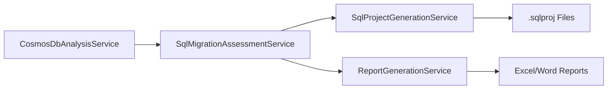

# SQL Database Project Generation Feature

## Overview

This feature adds the capability to generate SQL Server Database Projects (.sqlproj) directly from Cosmos DB migration assessments. The generated projects are compatible with SQL Server Data Tools (SSDT) and SqlPackage.exe for seamless deployment to Azure SQL Database.

## Features

### Generated Project Structure
```
sql-projects/
└── {DatabaseName}.Database/
    ├── {DatabaseName}.Database.sqlproj
    ├── Tables/
    │   ├── MainTable.sql
    │   └── ChildTable.sql
    ├── Indexes/
    │   └── Indexes.sql
    ├── ForeignKeys/
    │   └── ForeignKeys.sql
    └── Scripts/
        └── PostDeployment.sql
```

### Project Components

#### 1. **SQL Project File (.sqlproj)**
- MSBuild-compatible project file
- Targets Azure SQL Database (cloud-native)
- Ready for Visual Studio and Azure DevOps integration
- Includes all SQL files with proper build actions

#### 2. **Table Scripts**
- **Main Tables**: Normalized from Cosmos DB containers
- **Child Tables**: Extracted from arrays and nested objects
- **Business Keys**: Unique constraints on Cosmos DB document IDs
- **Audit Fields**: CreatedDate and ModifiedDate with defaults
- **Foreign Key Relationships**: Proper relational integrity

#### 3. **Index Scripts**
- Based on Cosmos DB usage analysis
- Clustered, non-clustered, and unique indexes
- Include columns for covering indexes
- Priority-based recommendations

#### 4. **Foreign Key Constraints**
- Parent-child relationships from normalized arrays
- Cascade delete/update rules
- Assessment-recommended business relationships

#### 5. **Deployment Scripts**
- Post-deployment configuration
- Query Store enablement
- Database-level performance settings
- Deployment notes and next steps

## Command Line Usage

### Default Behavior
```bash
# Generates both assessment reports AND SQL projects
CosmosToSqlAssessment --database MyDatabase
```

### Assessment Reports Only
```bash
# Skip SQL project generation
CosmosToSqlAssessment --assessment-only --database MyDatabase
```

### SQL Projects Only
```bash
# Skip assessment report generation
CosmosToSqlAssessment --project-only --database MyDatabase
```

### Multiple Databases
```bash
# Generate SQL projects for all databases
CosmosToSqlAssessment --all-databases --project-only
```

## Deployment Options

### Option 1: Visual Studio SSDT
1. Open the generated `.sqlproj` file in Visual Studio
2. Review the schema and make any necessary adjustments
3. Right-click project → **Publish**
4. Configure target Azure SQL Database
5. Deploy the schema

### Option 2: SqlPackage.exe (CI/CD)
```bash
# Build the project to create a DACPAC
msbuild MyDatabase.Database.sqlproj /p:Configuration=Release

# Deploy using SqlPackage.exe
sqlpackage.exe /Action:Publish 
    /SourceFile:bin\Release\MyDatabase.Database.dacpac 
    /TargetConnectionString:"Server=myserver.database.windows.net;Database=MyDatabase;..."
```

### Option 3: Azure DevOps Pipeline
```yaml
- task: MSBuild@1
  inputs:
    solution: 'sql-projects/**/*.sqlproj'
    configuration: 'Release'

- task: SqlDacpacDeploymentOnMachineGroup@0
  inputs:
    DacpacFile: 'sql-projects/**/bin/Release/*.dacpac'
    TargetMethod: 'connectionString'
    ConnectionString: '$(DatabaseConnectionString)'
```

## Schema Features

### Data Type Mapping
- **Enhanced Type Detection**: Analyzes actual data patterns
- **String Length Optimization**: Right-sized VARCHAR fields
- **Date/Time Recognition**: Automatic DATETIME2 mapping
- **GUID Detection**: UNIQUEIDENTIFIER for proper GUIDs
- **Numeric Precision**: Appropriate INT/DECIMAL sizing

### Normalization Strategy
- **Flat Fields**: Simple properties become table columns
- **Nested Objects**: Flattened with underscore notation
- **Arrays**: Extracted to separate child tables
- **Complex Structures**: JSON storage for unstructured data

### Relationship Detection
- **One-to-Many**: Arrays become child tables with foreign keys
- **One-to-One**: Detected and recommendation for table merging
- **Many-to-Many**: Junction table creation for complex relationships

## Best Practices

### Azure SQL Database Optimization
- **Query Store**: Automatically enabled for performance monitoring
- **Parameterization**: Forced for optimal plan reuse
- **Statistics**: Async update enabled
- **Collation**: SQL_Latin1_General_CP1_CI_AS recommended

### Security & Compliance
- **Audit Fields**: Standard CreatedDate/ModifiedDate tracking
- **Business Keys**: Unique constraints on natural keys
- **Referential Integrity**: Proper foreign key relationships
- **Index Coverage**: Covering indexes for common query patterns

### Performance Considerations
- **Clustered Indexes**: Identity-based primary keys
- **Non-Clustered Indexes**: Based on Cosmos DB query patterns
- **Include Columns**: Covering indexes for SELECT operations
- **Statistics**: Automatic maintenance enabled

## Migration Workflow

1. **Assessment Phase**
   ```bash
   CosmosToSqlAssessment --database MyDatabase
   ```

2. **Review Generated Schema**
   - Open Excel report for detailed analysis
   - Review SQL project structure
   - Validate table relationships

3. **Deploy Schema**
   ```bash
   sqlpackage.exe /Action:Publish /SourceFile:MyDatabase.Database.dacpac /TargetConnectionString:"..."
   ```

4. **Data Migration** (Future Feature)
   - Azure Data Factory pipeline generation
   - ETL transformations for complex structures
   - Data validation and testing

## Technical Architecture

### Service Integration


### Code Organization
- **SqlProjectGenerationService**: Main service class
- **XML Generation**: MSBuild-compatible project files
- **SQL Script Templates**: Table, index, and constraint generation
- **File System Management**: Organized directory structure

## Limitations & Future Enhancements

### Current Limitations
- Single database per project (no cross-database references)
- Basic stored procedure generation
- Manual configuration only (no advanced customization)

### Planned Enhancements
- Azure Data Factory pipeline generation
- Advanced ETL transformation scripts
- Custom template support
- Cross-database reference handling
- Stored procedure generation for data migration

## Troubleshooting

### Common Issues

#### Build Errors
```bash
# Ensure SSDT is installed
# Or use MSBuild with SQL tools
```

#### Deployment Failures
```bash
# Check connection string format
# Verify Azure SQL Database permissions
# Review generated SQL for compatibility
```

#### Schema Validation
```bash
# Use SSDT Schema Compare
# Validate against sample data
# Test with small dataset first
```

### Support Resources
- [Azure SQL Database Documentation](https://docs.microsoft.com/azure/azure-sql/database/)
- [SQL Server Data Tools (SSDT)](https://docs.microsoft.com/sql/ssdt/)
- [SqlPackage.exe Reference](https://docs.microsoft.com/sql/tools/sqlpackage/)
